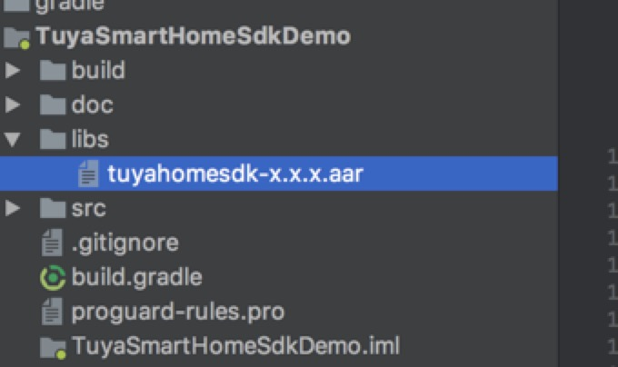

title: Android SDK 开发指南
subtitle: Android SDK 开发指南 
published: true    
---

# 涂鸦全屋智能Android SDK 接入指南


## 1.功能概述
涂鸦全屋智能SDK提供了以家庭为单位，对硬件设备、涂鸦云通讯的接口封装，加速应用开发过程，主要包括了以下功能：

- 硬件设备相关（配网、控制、状态上报、定时任务、群组、固件升级、共享）
- 账户体系（手机号、邮箱的注册、登录、重置密码等通用的账户功能）
- 家庭管理
- ZigBee网关
- 消息中心
- 意见反馈 
- 涂鸦云HTTP API接口封装 (参见[涂鸦云api调用](https://docs.tuya.com/cn/cloudapi/appAPI/index.html)）

---

## 2.集成准备

### 获取App ID和App Secret

开发平台上，在`应用管理`中新建一款应用，输入应用名称、应用包名、应用标示符等信息。创建成功后，即可获得App ID和Secret用于SDK开发。

 

---

## 3.集成SDK
### 3.1 集成准备
#### （1）创建工程

在Android Studio中建立你的工程。

#### （2）引入aar包


 


#### （3）build.gradle 配置

build.gradle 文件里添加如下配置

```groovy
defaultConfig {
ndk {
abiFilters "armeabi-v7a","x86"
}

gradle
repositories {
flatDir {
dirs 'libs'
}
}
dependencies {

compile 'com.alibaba:fastjson:1.1.45.android'
compile 'com.squareup.okhttp3:okhttp-urlconnection:3.2.0'
compile 'de.greenrobot:eventbus:2.4.0'
compile 'io.reactivex.rxjava2:rxandroid:2.0.1'
compile 'io.reactivex.rxjava2:rxjava:2.1.7'
compile 'org.eclipse.paho:org.eclipse.paho.client.mqttv3:1.2.0'
compile 'org.eclipse.paho:org.eclipse.paho.android.service:1.1.1'
compile(name: 'tuyasmart-x.x.x', ext: 'aar')
}


android {
lintOptions {
abortOnError false
disable 'InvalidPackage'
}

compileOptions {
sourceCompatibility JavaVersion.VERSION_1_7
targetCompatibility JavaVersion.VERSION_1_7
}
packagingOptions {
exclude 'META-INF/LICENSE.txt'
exclude 'META-INF/NOTICE'
exclude 'META-INF/LICENSE'
exclude 'META-INF/NOTICE.txt'
exclude 'META-INF/INDEX.LIST'
exclude 'META-INF/services/javax.annotation.processing.Processor'
}
}

```


##### 【注意事项】

涂鸦智能sdk默认只支持armeabi-v7a和x86架构的平台，如有其他平台需要可前往[GitHub](https://github.com/TuyaInc/tuyasmart_android_sdk/tree/master/library)获取

#### （4）AndroidManifest.xml 设置

在AndroidManifest.xml文件里配置appkey和appSecret，在配置相应的权限等

```xml
<meta-data
android:name="TUYA_SMART_APPKEY"
android:value="应用id" />
<meta-data
android:name="TUYA_SMART_SECRET"
android:value="应用密钥" />

添加必要的权限支持
<!-- sdcard -->
<uses-permission android:name="android.permission.WRITE_EXTERNAL_STORAGE" />
<uses-permission android:name="android.permission.READ_EXTERNAL_STORAGE" />
<uses-permission android:name="android.permission.READ_PHONE_STATE" android:required="false"/>
<!-- 网络 -->
<uses-permission android:name="android.permission.INTERNET" />
<uses-permission android:name="android.permission.CHANGE_NETWORK_STATE" />
<uses-permission android:name="android.permission.CHANGE_WIFI_STATE" />
<uses-permission android:name="android.permission.ACCESS_NETWORK_STATE" />
<uses-permission android:name="android.permission.ACCESS_WIFI_STATE" />
<uses-permission android:name="android.permission.WAKE_LOCK"android:required="false" />


添加必要的service和receiver
<service android:name="org.eclipse.paho.android.service.MqttService" />

<receiver android:name="com.tuya.smart.android.base.broadcast.NetworkBroadcastReceiver">
<intent-filter>
<action android:name="android.net.conn.CONNECTIVITY_CHANGE" />
</intent-filter>
</receiver>

<service
android:name="com.tuya.smart.android.hardware.service.GwBroadcastMonitorService"
android:exported="true"
android:label="UDPService"
android:process=":monitor">
<intent-filter>
<action android:name="tuya.intent.action.udp" />

<category android:name="tuya" />
</intent-filter>
</service>
<service
    android:name="com.tuya.smart.android.hardware.service.DevTransferService"
    android:label="TCPService">
    <intent-filter>
    	<action android:name="tuya.intent.action.tcp" />
           <category android:name="tuya" />
        </intent-filter>
</service>

```

#### （5）混淆配置

在proguard-rules.pro文件配置相应混淆配置

```
#EventBus
-keep class de.greenrobot.event.**{*;}
-dontwarn de.greenrobot.event.**
-keepclassmembers class ** {
public void onEvent*(**);
}

#commons
-keep class org.apache.commons.**{*;}
-dontwarn org.apache.commons.**

#fastJson
-keep class com.alibaba.fastjson.**{*;}
-dontwarn com.alibaba.fastjson.**

#netty
-keep class io.netty.** { *; }
-dontwarn io.netty.**

#mqtt
-keep class org.eclipse.paho.android.service.** { *; }
-keep class org.eclipse.paho.client.mqttv3.** { *; }

-dontwarn org.eclipse.paho.android.service.**
-dontwarn org.eclipse.paho.client.mqttv3.**

-dontwarn okio.**
-dontwarn rx.**
-dontwarn javax.annotation.**
-keep class com.squareup.okhttp.** { *; }
-keep interface com.squareup.okhttp.** { *; }
-keep class okio.** { *; }
-dontwarn com.squareup.okhttp.**

-keep class com.tuya.smart.**{*;}
-dontwarn com.tuya.smart.**


```


### 3.2 在代码中使用SDK功能

	TuyaHomeSdk 是一切全屋智能API对外的接口，包含：配网、初始化、控制、房间、群组、ZigBee等一系列的操作。
#### (1) Application中初始化涂鸦智能sdk。
##### 【描述】

主要用于初始化通信服务等组件。

##### 【代码范例】

```java
public class TuyaSmartApp extends Application {
    @Override
    public void onCreate() {
        super.onCreate();
        TuyaHomeSdk.init(this);
    }
}
```

##### 【注意事项】

appId和appSecret需要配置AndroidManifest.xml文件里，或者在build环境里配置，也可以在代码里写入。
#### (2)  注销涂鸦智能云连接
在退出应用的时候调用以下接口注销掉。

```java
TuyaHomeSdk.onDestroy();
```

#### (3)  注册session失效监听
##### 【描述】

Session由于可能存在一些异常或者在一段时间不操作（45天）会失效掉，这时候需要退出应用，重新登陆获取Session。

##### 【方法调用】

```java
//session失效监听
TuyaHomeSdk.setOnNeedLoginListener(INeedLoginListener needLoginListener);
```
##### 【实现回调】

```java
needLoginListener.onNeedLogin(Context context);
```
##### 【代码范例】

```java
public class TuyaSmartApp extends Application {

        @Override
        public void onCreate() {
            super.onCreate();
            //需要在application里面注册
  			  TuyaHomeSdk.setOnNeedLoginListener(new INeedLoginListener() {
     		  @Override
      		  public void onNeedLogin(Context context) {

      		  }
    });
```
【注意事项】

- 一旦出现此类回调，请跳转到登陆页面，让用户重新登陆。

---


## 4.用户管理
### 4.1 用户手机验证码登陆

涂鸦智能提供手机验证码登陆体系。
#### (1)手机验证码登陆
##### 【描述】

手机验证码登陆，支持国内手机验证码登陆。
##### 【代码调用】

```java
//获取手机验证码
* @param countryCode   国家区号
* @param phoneNumber   手机号码
TuyaHomeSdk.getUserInstance().getValidateCode(String countryCode, String phoneNumber, final IValidateCallback callback);
//手机验证码登陆
* @param countryCode 国家区号
* @param phone       电话
* @param code        验证码
* @param callback    登陆回调接口
TuyaHomeSdk.getUserInstance().loginWithPhone(String countryCode, String phone, String code, final ILoginCallback callback)
```

##### 【代码范例】

```java
//获取手机验证码
TuyaHomeSdk.getUserInstance().getValidateCode("86","13666666666", new IValidateCallback(){
    @Override
    public void onSuccess() {
        Toast.makeText(mContext, "获取验证码成功", Toast.LENGTH_SHORT).show();
    }

    @Override
    public void onError(String code, String error) {
        Toast.makeText(mContext, "code: " + code + "error:" + error, Toast.LENGTH_SHORT).show();
    }
});
//手机验证码登陆
TuyaHomeSdk.getUserInstance().loginWithPhone("86", "13355555555", "123456", new ILoginCallback() {
    @Override
    public void onSuccess(User user) {
        Toast.makeText(mContext, "登录成功，用户名：" +TuyaHomeSdk.getUserInstance().getUser().getUsername(), Toast.LENGTH_SHORT).show();
    }
    @Override
    public void onError(String code, String error) {
        Toast.makeText(mContext, error, Toast.LENGTH_SHORT).show();
    }
});
```
### 4.2 用户手机密码登陆

涂鸦智能提供手机密码登陆体系。
#### (1)手机密码注册
##### 【描述】

手机密码注册。支持国内外手机注册。
##### 【方法调用】

```java
//获取手机验证码
* @param countryCode   国家区号
* @param phoneNumber   手机号码
TuyaHomeSdk.getUserInstance().getValidateCode(String countryCode, String phoneNumber, final IValidateCallback callback);

//注册手机密码账户
* @param countryCode 国家区号
* @param phone       手机密码
* @param passwd      登陆密码
* @param callback    登陆回调接口
TuyaHomeSdk.getUserInstance().registerAccountWithPhone(final String countryCode, final String phone, final String passwd, final String code, final IRegisterCallback callback);
```
##### 【代码范例】

```java

//获取手机验证码
TuyaHomeSdk.getUserInstance().getValidateCode("86","13666666666", new IValidateCallback(){
    @Override
    public void onSuccess() {
        Toast.makeText(mContext, "获取验证码成功", Toast.LENGTH_SHORT).show();
    }

    @Override
    public void onError(String code, String error) {
        Toast.makeText(mContext, "code: " + code + "error:" + error, Toast.LENGTH_SHORT).show();
    }
 });
//注册手机密码账户
TuyaHomeSdk.getUserInstance().registerAccountWithPhone("86","13666666666","123456","124332", new IRegisterCallback() {
    @Override
    public void onSuccess(User user) {
        Toast.makeText(mContext, "注册成功", Toast.LENGTH_SHORT).show();
    }
    @Override
    public void onError(String code, String error) {
        Toast.makeText(mContext, "code: " + code + "error:" + error, Toast.LENGTH_SHORT).show();
    }
});
```
#### (2)手机密码登陆
##### 【描述】

手机密码登陆。
##### 【方法调用】

```java
//手机密码登陆
* @param countryCode 国家区号
* @param phone       手机密码
* @param passwd      登陆密码
* @param callback    登陆回调接口
TuyaHomeSdk.getUserInstance().loginWithPhonePassword(String countryCode, String phone, String passwd, final ILoginCallback callback);
```
##### 【代码范例】

```java
//手机密码登陆
TuyaHomeSdk.getUserInstance().loginWithPhonePassword("86", "13666666666", "123456", new ILoginCallback() {
    @Override
    public void onSuccess(User user) {
        Toast.makeText(mContext, "登录成功，用户名：" +TuyaHomeSdk.getUserInstance().getUser().getUsername(), Toast.LENGTH_SHORT).show();
    }

    @Override
    public void onError(String code, String error) {
        Toast.makeText(mContext, "code: " + code + "error:" + error, Toast.LENGTH_SHORT).show();
    }
});
```
#### (3)手机重置密码
##### 【描述】

手机密码登陆 重置密码。
##### 【方法调用】

```java
//获取手机验证码
* @param countryCode   国家区号
* @param phoneNumber   手机号码
TuyaHomeSdk.getUserInstance().getValidateCode(String countryCode, String phoneNumber, final IValidateCallback callback);

//重置密码
* @param countryCode 国家区号
* @param phone       手机号码
* @param code        手机验证码
* @param newPasswd   新密码
* @param callback    重置手机密码回调接口
TuyaHomeSdk.getUserInstance().resetPhonePassword(final String countryCode, final String phone, final String code, final String newPasswd, final IResetPasswordCallback callback);

```
##### 【代码范例】

```java
//手机获取验证码
TuyaHomeSdk.getUserInstance().getValidateCode("86", "13555555555", new IValidateCallback() {
    @Override
    public void onSuccess() {
        Toast.makeText(mContext, "获取验证码成功", Toast.LENGTH_SHORT).show();
    }

    @Override
    public void onError(String code, String error) {
        Toast.makeText(mContext, "code: " + code + "error:" + error, Toast.LENGTH_SHORT).show();
    }
});
//重置手机密码
TuyaHomeSdk.getUserInstance().resetPhonePassword("86", "13555555555", "123456", "123123", new IResetPasswordCallback(){
    @Override
    public void onSuccess() {
        Toast.makeText(mContext, "找回密码成功", Toast.LENGTH_SHORT).show();
    }

    @Override
    public void onError(String code, String error) {
        Toast.makeText(mContext, "code: " + code + "error:" + error, Toast.LENGTH_SHORT).show();
    }
});
```
### 4.3 用户邮箱密码登陆
涂鸦智能提供邮箱密码登陆体系。
#### (1) 用户邮箱密码注册
##### 【描述】

用户邮箱密码注册。支持国内外邮箱注册。
##### 【方法调用】

```java
//邮箱密码注册
* @param countryCode 国家区号
* @param email       邮箱账户
* @param passwd      登陆密码
* @param callback    邮箱注册回调接口
TuyaHomeSdk.getUserInstance().registerAccountWithEmail(final String countryCode, final String email, final String passwd, final IRegisterCallback callback);
```
##### 【代码范例】

```java
//邮箱密码注册
TuyaHomeSdk.getUserInstance().registerAccountWithEmail("86", "123456@123.com","123456", new IRegisterCallback() {
    @Override
    public void onSuccess(User user) {
        Toast.makeText(mContext, "注册成功", Toast.LENGTH_SHORT).show();
    }

    @Override
    public void onError(String code, String error) {
        Toast.makeText(mContext, "code: " + code + "error:" + error, Toast.LENGTH_SHORT).show();
    }
});
```
##### 【注意事项】

*   账户一旦注册到一个国家，目前数据无法迁移其他国家。

#### (2) 用户邮箱密码登陆
##### 【描述】

用户邮箱密码登陆

##### 【方法调用】

```java
//邮箱密码登陆
* @param email  邮箱账户
* @param passwd 登陆密码
TuyaHomeSdk.getUserInstance().loginWithEmail(String countryCode, String email, String passwd, final ILoginCallback callback);
```
##### 【代码范例】

```java
//邮箱密码登陆
TuyaHomeSdk.getUserInstance().loginWithEmail("86", "123456@123.com", "123123", new ILoginCallback() {
    @Override
    public void onSuccess(User user) {
        Toast.makeText(mContext, "登录成功，用户名：").show();
    }

    @Override
    public void onError(String code, String error) {
        Toast.makeText(mContext, "code: " + code + "error:" + error, Toast.LENGTH_SHORT).show();
    }
});
```
#### (3) 用户邮箱重置密码
##### 【描述】

用户邮箱重置密码
##### 【方法调用】

```java
//邮箱找回密码，获取验证码
* @param countryCode 国家区号
* @param email       邮箱账户
* @param callback    获取验证码回调接口
TuyaHomeSdk.getUserInstance().getEmailValidateCode(String countryCode, final String email, final IValidateCallback callback);

//邮箱重置密码
* @param email     用户账户
* @param emailCode 邮箱验证码
* @param passwd    新密码
* @param callback  重置密码回调接口
TuyaHomeSdk.getUserInstance().resetEmailPassword(final String email, final String emailCode, final String passwd, final IResetPasswordCallback callback);
```
##### 【代码范例】

```java
//获取邮箱验证码
TuyaHomeSdk.getUserInstance().getEmailValidateCode("86", "123456@123.com", new IValidateCallback() {
    @Override
    public void onSuccess() {
        Toast.makeText(mContext, "获取验证码成功", Toast.LENGTH_SHORT).show();
    }
    @Override
    public void onError(String code, String error) {
        Toast.makeText(mContext, "code: " + code + "error:" + error, Toast.LENGTH_SHORT).show();
    }
});
//重置密码
TuyaHomeSdk.getUserInstance().resetEmailPassword("86", "123456@123.com", "123123", new IResetPasswordCallback() {
    @Override
    public void onSuccess() {
        Toast.makeText(mContext, "找回密码成功", Toast.LENGTH_SHORT).show();
    }
    @Override
    public void onError(String code, String error) {
        Toast.makeText(mContext, "code: " + code + "error:" + error, Toast.LENGTH_SHORT).show();
    }
});
```
### 4.4 用户uid登陆体系
涂鸦智能提供uid登陆体系。如果客户自有用户体系，那么可以通过uid登陆体系，接入我们的sdk。
#### (1) 用户uid注册

##### 【描述】

用户uid注册
##### 【方法调用】

```java
//用户uid注册
* @param countryCode 国家号码
* @param uid         用户uid
* @param password    用户密码
* @param callback    uid 注册回调接口
TuyaHomeSdk.getUserInstance().registerAccountWithUid(String countryCode, String uid, String password, IRegisterCallback callback);
```
##### 【代码范例】

```java
//uid注册
TuyaHomeSdk.getUserInstance().registerAccountWithUid("86", "1234","123456", new IRegisterCallback() {
    @Override
    public void onSuccess(User user) {
        Toast.makeText(mContext, "UID注册成功", Toast.LENGTH_SHORT).show();
    }
    @Override
    public void onError(String code, String error) {
        Toast.makeText(mContext, "code: " + code + "error:" + error, Toast.LENGTH_SHORT).show();
    }
});
```
#### (2) 用户uid登陆
##### 【描述】

用户uid登陆
##### 【方法调用】

```java
//uid 登陆
* @param countryCode 国家号码
* @param uid         用户uid
* @param passwd      用户密码
* @param callback    uid 登陆回调接口
TuyaHomeSdk.getUserInstance().loginWithUid(String countryCode, String uid, String passwd, ILoginCallback callback);
```
##### 【代码范例】

```java
//uid登陆
TuyaHomeSdk.getUserInstance().loginWithUid("86", "1234", "123456", new ILoginCallback() {
    @Override
    public void onSuccess(User user) {
        Toast.makeText(mContext, "登录成功，用户名：" , Toast.LENGTH_SHORT).show();
    }

    @Override
    public void onError(String code, String error) {
        Toast.makeText(mContext, "code: " + code + "error:" + error, Toast.LENGTH_SHORT).show();
    }    @Override
    public void onSuccess(User user) {
        Toast.makeText(mContext, "登录成功，用户名：" , Toast.LENGTH_SHORT).show();
    }

    @Override
    public void onError(String code, String error) {
        Toast.makeText(mContext, "code: " + code + "error:" + error, Toast.LENGTH_SHORT).show();
    }
});
```
#### (3) 用户uid重置密码
##### 【描述】

用户uid重置密码
##### 【方法调用】

```java
//用户uid重置密码
* @param countryCode 国家号码
* @param uid         用户uid
* @param passwd      用户密码
* @param callback    重置UID 密码回调接口
TuyaHomeSdk.getUserInstance().resetUidPassword(String countryCode, String uid, String passwd, IResetPasswordCallback callback);
```
##### 【代码范例】

```java
//重置uid密码
TuyaHomeSdk.getUserInstance().resetUidPassword("86", "1234", "123456", new IResetPasswordCallback() {
    @Override
    public void onSuccess() {
        Toast.makeText(mContext, "重置密码成功", Toast.LENGTH_SHORT).show();
    }
    @Override
    public void onError(String code, String error) {
        Toast.makeText(mContext, "code: " + code + "error:" + error, Toast.LENGTH_SHORT).show();
    }
});
```

### 4.5 上传用户头像
上传用户的头像。
##### 【描述】
用于上传用户自定义的头像。
##### 【方法原型】
```java
/**
 * 上传用户头像
 *
 * @param file     用户头像图片文件
 * @param callback 回调
 */
void uploadUserAvatar(File file, IBooleanCallback callback)
```
##### 【代码范例】
```java
TuyaHomeSdk.getUserInstance().uploadUserAvatar(
    file, 
    new IBooleanCallback() {
        @Override
        public void onSuccess() {
        }

        @Override
        public void onError(String code, String error) {

        }
});
```

### 4.6 退出登录接口

用户账号切换的时候需要调用退出登录接口

```
       TuyaHomeSdk.getUserInstance().logout(new ILogoutCallback() {
            @Override
            public void onSuccess() {
            	//退出登录成功
            }

            @Override
            public void onError(String errorCode, String errorMsg) {
            }
        });

```

### 4.7 数据模型
用户相关的数据模型。

#### User
* nickName  昵称
* phoneCode 国家区号
* mobile 手机号码
* username 用户名称
* email 邮箱地址
* uid 用户唯一标识符
* sid 用户登录产生唯一标识id.
* headPic 用户头像路径

----
## 5.设备配网
TuyaActivator 集成了WiFi配网、ZigBee配网、蓝牙mesh配网等。

### WiFi配网
##### 【描述】
	WiFi配网主要有EZ模式和AP模式两种

##### 【初始化参数配置】

```java
TuyaHomeSdk.getActivatorInstance().newActivator(new ActivatorBuilder()
.setSsid(ssid)
.setContext(mContext)
.setPassword(password)
//EZ模式
.setActivatorModel(ActivatorModelEnum.TY_EZ)
//AP模式
.setActivatorModel(ActivatorModelEnum.TY_AP)
//超时时间
.setTimeOut(CONFIG_TIME_OUT) //unit is seconds
.setToken(token).setListener();
```
##### 【参数说明】

###### 【入参】

```java
* @param token  配网所需要的激活key。需要通过方法TuyaActivator.getInstance().getActivatorToken ()接口获取;Token的有效期为10分钟，且配置成功后就会失效（再次配网需要重新获取）
* @param ssid   配网之后，设备工作WiFi的名称。（家庭网络）
* @param password   配网之后，设备工作WiFi的密码。（家庭网络）
* @param activatorModel:	现在给设备配网有以下两种方式:
ActivatorModelEnum.TY_EZ: 传入该参数则进行EZ配网
ActivatorModelEnum.TY_AP: 传入该参数则进行AP配网
* @param timeout     配网的超时时间设置，默认是100s.
* @param context:  	需要传入activity 的context.
```

###### 【出参】

ITuyaSmartActivatorListener listener 配网回调接口

```java
* @method onError(String errorCode,String errorMsg);			

@param errorCode:
1001        网络错误
1002        配网设备激活接口调用失败，接口调用不成功
1003        配网设备激活失败，设备找不到。
1004        token 获取失败
1005        设备没有上线
1006        配网超时

@param errorMsg:
暂时没有数据，请参考errorCode。

* @method onActiveSuccess(DeviceBean deviceBean);		设备配网成功,且设备上线（手机可以直接控制），可以通过
* @method onStep(String step, Object o);	
|@param step         |@param o
|device_find         |devId (String)
|device_bind_success |dev (DeviceBean)
【备注】
device_find 发现设备
device_bind_success 设备绑定成功，但还未上线，此时设备处于离线状态，无法控制设备。
```

##### 【方法调用】

```java
//getActivator Token
TuyaHomeSdk.getActivatorInstance().getActivatorToken(long homeId,ITuyaActivatorGetToken listener);
//开始配置
mTuyaActivator.startConfig();
//停止配置
mTuyaActivator.stopConfig();
//退出页面销毁一些缓存和监听
mTuyaActivator.onDestroy();
```

##### 【代码范例】

```java
//初始化回调接口
ITuyaSmartActivatorListener mListener = new ITuyaSmartActivatorListener() {

    @Override
    public void onError(String errorCode, String errorMsg){
    }

    @Override
    public void onActiveSuccess(GwDevResp gwDevResp) {
    }

    @Override
    public void onStep(String step, Object o) {
    }
};

//配置相应参数
mTuyaActivator = TuyaHomeSdk.getActivatorInstance().newMultiActivator(new 	ActivatorBuilder()
.setSsid("ssid")
.setContext(mContext)
.setPassword("password")
.setActivatorModel(ActivatorModelEnum.TY_EZ)
.setTimeOut(100)
.setToken(token).setListener(mListener)
//开始配置
mTuyaActivator.start();
//停止配置
mTuyaActivator.stop();
//回调销毁
mTuyaActivator.onDestroy();
```


#### 【配网问题汇总】
#####  配网超时，此时设备一直处于连不上网络的状态。有以下几种原因。
- 获取WiFi Ssid 错误，导致配网失败
  安卓系统API里面获取到ssid，通常前后会有“”。
  建议使用Tuya Sdk里面自带的WiFiUtil.getCurrentSSID()去获取
  
-  WiFi密码包含空格
  用户在输入密码的时候，由于输入法联想的功能很容易在密码中输入空格。建议密码输入的时候直接显示出来，另外在判断密码含有空格的时候，弹窗提醒用户。
  
- 用户不输入WiFi密码
  用户在首次使用智能设备产品的过程中，很容易不输入密码就进行后续操作
  建议判断密码输入为空且WiFi加密类型不为NONE时，弹窗提醒用户。
  
- 用户在AP配网时选择了设备的热点名称，用户首次使用智能产品的过程中，很容易出现此问题。
  建议在判别AP配网时用户选择了设备的热点名称，弹窗提醒给用户。
  
- 获取WiFi的Ssid为"0x","\<unknown ssid\>"
  目前发现在一些国产手机会出现此问题。并不是用户选择的WiFi名称。这是由于定位权限没开启导致的，建议用户可以手动输入WiFi的Ssid，或者给出弹窗提醒，让用户开启相应权限。

#####  配网超时，此时设备已经激活成功。可能原因有：

* APP没有连接到正常的网络，导致无法获取设备的状态。


### ZigBee网关配网

	这里的ZigBee网关配网是指有线配网
#### ZigBee网关有线配网
ZigBee网关配网前，请确保ZigBee网关设备连接上外网联通的路由器，并使ZigBee网关设备处于配网状态

##### 【方法调用】

```java
//需要传入HomeId getActivator Token 
TuyaHomeSdk.getActivatorInstance().getActivatorToken(long homeId,ITuyaActivatorGetToken listener);
//开始配置
mTuyaActivator.startConfig();
//停止配置
mTuyaActivator.stopConfig();
//退出页面销毁一些缓存和监听
mTuyaActivator.onDestroy();
```

##### 【代码范例】
	
	//初始化监听
	ITuyaSmartActivatorListener  listener =new ITuyaSmartActivatorListener() {
                    @Override
                    public void onError(String errorCode, String errorMsg) {
							
                    }

                    @Override
                    public void onActiveSuccess(DeviceBean deviceBean) {
                    	
                    }

                    @Override
                    public void onStep(String step, Object data) {

                    }
                })
	ITuyaActivator mITuyaActivator = TuyaHomeSdk.getActivatorInstance().newGwActivator(new TuyaGwActivatorBuilder()
                .setToken(token)
                .setTimeOut(100)
                .setContext(this)
                .setListener(listener);
                
	//开始配网
	mITuyaActivator.start()
	//停止配网
	mITuyaActivator.stop()
	//退出页面清理
	mITuyaActivator.onDestroy()

---

#### ZigBee子设备配网

ZigBee子设备配网需要ZigBee网关设备云在线的情况下才能发起,且子设备处于配网状态。

##### 【方法调用】

```java
TuyaHomeSdk.getActivatorInstance().newGwSubDevActivator(TuyaGwSubDevActivatorBuilder builder)
//开始配置
mTuyaActivator.start();
//停止配置
mTuyaActivator.stop();
//退出页面销毁一些缓存和监听
mTuyaActivator.onDestroy();
```
	
##### 【代码范例】

```java

TuyaGwSubDevActivatorBuilder builder = new TuyaGwSubDevActivatorBuilder()
					//设置网关ID
                .setDevId(mDevId)
                //设置配网超时时间
                .setTimeOut(100)
                .setListener(new ITuyaSmartActivatorListener() {
                    @Override
                    public void onError(String s, String s1) {
                    }

                    @Override
                    public void onActiveSuccess(DeviceBean deviceBean) {
                    }

                    @Override
                    public void onStep(String s, Object o) {
                    }
                });

        mTuyaGWActivator = TuyaHomeSdk.getActivatorInstance(). newGwSubDevActivator(builder);
        //开始配网
        mTuyaGWActivator.start();
        //停止配网
        mTuyaGWActivator.stop();
        //销毁
        mTuyaGWActivator.onDestory();


```

## 6.设备控制

### 6.1 设备信息获取
##### 【描述】

涂鸦智能提供了丰富的接口供开发者实现设备信息的获取和管理能力(移除等)。设备相关的返回数据都采用异步消息的方式通知接受者。我们采用了EventBus的方案来实现消息通知。因此在每个设备操作页面都需要注册和销毁通知对象。具体请参考demo实现。

##### 【方法调用】

```java

```

##### 【注意事项】


* schema dp数据相关介绍[详见功能点相关概念][3]
* 分享设备是不能被删除的

---

### 6.2 设备操作控制

ITuyaDevice类提供了设备状态通知能力，通过注册回调函数，开发者可以方便的获取设备数据接受、设备移除、设备上下线、手机网络变化的通知。同时也提供了控制指令下发，设备固件升级的接口。
```java
//根据设备id初始化设备控制类
ITuyaDevice mDevice = TuyaHomeSdk.newDeviceInstance(deviceBean.getDevId());
```

#### 设备功能点
DeviceBean 类 dps 属性定义了设备的状态，称作数据点（DP点）或功能点。`dps`字典里的每个`key`对应一个功能点的`dpId`，`dpValue`为该功能点的值。各自产品功能点定义参见[涂鸦开发者平台](https://developer.tuya.com/)的产品功能。
功能点具体参见[快速入门-功能点相关概念](https://docs.tuya.com/cn/creatproduct/#_7)

##### 【指令格式】

发送控制指令按照以下格式：
{"(dpId)":"(dpValue)"}

##### 【功能点示例】
开发平台可以看到一个产品这样的界面


根据后台该产品的功能点定义，示例代码如下:

```java

//设置dpId为1的布尔型功能点示例 作用:开关打开 
dps = {"1": true};

//设置dpId为4的字符串型功能点示例 作用:设置RGB颜色为ff5500
dps = {"4": "ff5500"};

//设置dpId为5的枚举型功能点示例 作用:设置档位为2档
dps = {"5": "2"};

//设置dpId为6的数值型功能点示例 用:设置温度为20°
dps = {"6": 20};

//设置dpId为15的透传型(byte数组)功能点示例 作用:透传红外数据为1122
dps = {"15": "1122"};

//多个功能合并发送
dps = {"1": true, "4": "ff5500"};

mDevice.publishDps(dps, new IControlCallback() {
@Override
public void onError(String code, String error) {}
@Override
public void onSuccess() {
}
});
```
##### 【注意事项】
* 控制命令的发送需要特别注意数据类型。<br />
比如功能点的数据类型是数值型（value），那控制命令发送的应该是 `{"2": 25}`  而不是  `{"2": "25"}`<br />
* 透传类型传输的byte数组是字符串格式并且必须是偶数位。<br />
比如正确的格式是: `{"1": "0110"}` 而不是 `{"1": "110"}`


####  初始化数据监听
##### 【描述】

TuyaHomeDevice提供设备相关信息（dp数据、设备名称、设备在线状态和设备移除）的监听，会实时同步到这里。

##### 【实现回调】

```java
mDevice.registerDevListener(new IDevListener() {
    @Override
    public void onDpUpdate(String devId, String dpStr) {
    //dp数据更新:devId 和相应dp数据
    }
    @Override
    public void onRemoved(String devId) {
    //设备被移除
    }
    @Override
    public void onStatusChanged(String devId, boolean online) {
    //设备在线状态，online
    }
    @Override
    public void onNetworkStatusChanged(String devId, boolean status) {
    //网络状态监听
    }
    @Override
    public void onDevInfoUpdate(String devId) {
    //设备信息变更，目前只有设备名称变化，会调用该接口
    }
});
```

#### 数据下发

##### 【描述】

通过局域网或者云端这两种方式发送控制指令给设备。

##### 【方法调用】

```java
//发送控制命令给硬件
mDevice.send(String command,IControlCallback callback);
```
##### 【代码范例】


以灯类产品作为示例

1、定义灯开关dp点
```java
public static final String STHEME_LAMP_DPID_1 = "1"; //灯开关 
```

2、关于灯开关的数据结构：

```java
public class LampBean {
	private boolean open;
	
	public boolean isOpen() {
		return open;
	}

	public void setOpen(boolean open) {
		this.open = open;
	}
}
```

3、对设备进行初始化

```java
/**
 * 设备对象。该设备的所有dp变化都会通过callback返回。
 *
 * 初始化设备之前，请确保已经初始化连接服务端，否则无法获取到服务端返回信息
 */
mDevice = new TuyaHomeSdk.newDeviceInstance(mDevId);

mDevice.registerDevListener(new IDevListener() {
    @Override
    public void onDpUpdate(String devId, String dpStr) {
        //dp数据更新:devId 和相应dp数据
    }
    @Override
    public void onRemoved(String devId) {
        //设备被移除
    }
    @Override
    public void onStatusChanged(String devId, boolean online) {
        //设备在线状态，online
        //这个statusChange是指硬件设备和云端通信是否正常。
    }
    @Override
    public void onNetworkStatusChanged(String devId, boolean status) {
        //网络状态监听
        //这个onNetworkStatusChanged是指手机和云端通信是否正常。
    }
    @Override
    public void onDevInfoUpdate(String devId) {
        //设备信息变更，目前只有设备名称变化，会调用该接口
    }
});
```

4、开灯的代码片段

```java
 public void openLamp() {
    LampBean bean = new LampBean();
    bean.setOpen(true);
    HashMap<String, Object> hashMap = new HashMap<>();
    hashMap.put(STHEME_LAMP_DPID_1, bean.isOpen());
    mDevice.publishDps(JSONObject.toJSONString(hashMap), new IControlCallback() {
        @Override
        public void onError(String code, String error) {
            Toast.makeText(mContext, "开灯失败", Toast.LENGTH_SHORT).show();
        }

        @Override
        public void onSuccess() {
            Toast.makeText(mContext, "开灯失败", Toast.LENGTH_SHORT).show();
        }
    });
}
```

5、注销设备监听事件
```java
mDevice.unRegisterDevListener();
```

6、设备资源销毁
```java
mDevice.onDestroy();
```

##### 【注意事项】

*  指令下发成功并不是指设备真正操作成功，只是意味着指令成功发送出去。操作成功会有dp数据信息上报上来 ，且通过`IDevListener onDpUpdate`接口返回。
*  command 命令字符串 是以`Map<String dpId,Object dpValue>` 数据格式转成JsonString。
*  command 命令可以一次发送多个dp数据。


#### 设备信息查询
##### 【描述】

查询单个dp数据 从设备上查询dp最新数据 会经过 IDevicePanelCallback onDpUpdate 接口回调。

##### 【方法调用】

```java
mDevice.getDp(String dpId, IControlCallback callback);
```
##### 【代码范例】

```java
1、通过调用mTuyaDevice.getDp方法。

2、数据会通过dp数据更新监听上报上来。
IDevListener.onDpUpdate(String devId,String dpStr)
```

##### 【注意事项】 

* 该接口主要是针对那些数据不主动去上报的dp点。 常规查询dp数据值可以通过 DeviceBean里面 getDps()去获取。


#### 设备重命名
##### 【描述】

设备重命名，支持多设备同步。
##### 【方法调用】
```java
//重命名
mDevice.renameGw(String name,IControlCallback callback);
```
##### 【代码范例】

```java
mDevice.renameGw("设备名称", new IControlCallback() {
    @Override
    public void onError(String code, String error) {
        //重命名失败
    }
    @Override
    public void onSuccess() {
        //重命名成功
    }
});
```

成功之后 ，`IDevListener.onDevInfoUpdate()` 会收到通知。

调用以下方法获取最新数据，然后刷新设备信息即可。

```java
TuyaHomeDataManager.getInstance().getDeviceBean(String devId);
```

#### 获取数据点的历史数据

##### 【描述】
获取dp点的历史状态数据，例如电量等信息。
##### 【方法调用】

```java
* @param type           获取历史数据type类型值 hour day month
* @param number         获取历史数据点最大个数 value(1-50)
* @param dpId           获取历史数据的dp点值
* @param startTime      获取历史数据点的坐标日期
getDataPointStat(DataPointTypeEnum type, long startTime, int number, String dpId, final IGetDataPointStatCallback callback)
```


```java
long startTime = System.currentTimeMillis(); //startTime起始时间
int number = 12;//往前获取历史数据结果值的个数 ，最大是50
String dpId = "1";
mDevice.getDataPointStat(DataPointTypeEnum.DAY, startTime, number, dpId, new IGetDataPointStatCallback() {
    @Override
    public void onError(String errorCode, String errorMsg) {
        Toast.makeText(mContext, "获取历史数据失败" + errorMsg, Toast.LENGTH_SHORT).show();
    }

    @Override
    public void onSuccess(DataPointStatBean bean) {
        Toast.makeText(mContext, "获取历史数据成功：", Toast.LENGTH_SHORT).show();
    }
});
```

#### 移除设备
##### 【描述】
用于从用户设备列表中移除设备
##### 【方法调用】
```java
/**
 * 移除设备
 *
 * @param callback
 */
void removeDevice(IControlCallback callback);
```
##### 【代码范例】
```java
mDevice.removeDevice(new IControlCallback() {
    @Override
    public void onError(String errorCode, String errorMsg) {
    }

    @Override
    public void onSuccess() {
    }
});
```

### 数据模型
#### DeviceBean

* iconUrl 设备图标链接地址
* devId 设备唯一标示id
* isOnline 设备是否在线（局域网或者云端在线） 
* name 设备名称
* schema 用来描述设备dp点属性
* productId 产品唯一标示id
* pv  网关通信协议版本 用x.x来表示 。
* bv  网关通用固件版本 用x.x来表示。
* time 设备添加时间
* isShare 设备是否被分享
* schemaMap Map类型 key 表示dpId， value 表示Schema 数据。
* dps  设备当前数据信息。key 是 dpId ，value 是值。
* lon、lat用来标示经纬度信息，需要用户使用sdk前，调用TuyaSdk.setLatAndLong 设置经纬度信息。
* isZigBeeWifi 是否是ZigBee网关设备
* hasZigBee 是否包含ZigBee能力（网关设备或者子设备）


---

## 7.共享设备

涂鸦智能提供了向好友分享控制设备的能力。支持分享者和被分享者对分享的设备进行增加、删除、查询、修改。

### 7.1 添加分享

#### (1)添加多个设备共享（覆盖）
##### 【描述】
分享多个设备给指定用户，会将指定用户的以前所有分享覆盖掉
##### 【方法调用】

```java
@param homeId	 家庭id
@param countryCode 国家码
@param userAccount 账号
@param ShareIdBean 分享内容 目前支持 设备或者mesh
@param autoSharing 是否自动分享新增的设备，如果为true，则分享者以后新增的设备都会自动分享给该指定用户（mesh暂不支持该选项）

void addShare(long homeId, String countryCode, String userAccount, ShareIdBean bean, boolean autoSharing, ITuyaResultCallback<SharedUserInfoBean> callback);


```
##### 【代码范例】

```java
TuyaHomeSdk.getDeviceShareInstance.addShare(homeId, countryCode, userAccount, bean, true, new ITuyaResultCallback<SharedUserInfoBean>() {
            @Override
            public void onSuccess(SharedUserInfoBean bean) {
                
            }

            @Override
            public void onError(String errorMsg, String errorCode) {
                
            }
        });
```

#### (2)添加多个设备共享（追加）
##### 【描述】
分享多个设备给指定用户，会将要分享的设备追加到指定用户的所有分享中
##### 【方法调用】

```java
@param homeId		分享者家庭id
@param countryCode   国家区号
@param phoneNumber   手机号码
@param devIds 		 分享的设备id列表

TuyaHomeSdk.getDeviceShareInstance().addShareWithHomeId(long homeId,String countryCode, String userAccount, List<String> devIds, ITuyaResultCallback<SharedUserInfoBean> callback);

```
##### 【代码范例】

```java
TuyaHomeSdk.getDeviceShareInstance().addShareWithHomeId(homeId, countryCode, userAccount, devIds, new ITuyaResultCallback<SharedUserInfoBean>() {
    @Override
    public void onSuccess(SharedUserInfoBean bean) {
    }

    @Override
    public void onError(String errorMsg, String errorCode) {
    }
        });
```

```java
/**
 * 批量添加设备共享
 * @param memberId 分享目标用户id
 * @param devIds 设备id列表
 * @param callback
 */
void addShareWithMemberId(long memberId,List<String> devIds,IResultCallback callback);

```
##### 【代码范例】

```java
TuyaHomeSdk.getDeviceShareInstance().addShareWithMemberId (memberId, devIds, new IResultCallback() {
    @Override
    public void onError(String code, String error) {
        
    }

    @Override
    public void onSuccess() {

    }
});
```

#### (3)单个设备取消共享
##### 【描述】
通过用户关系id取消单个设备分享
##### 【方法调用】

```java

/**
 * 用户下的设备分享关闭
 *
 * @param devId
 * @param memberId
 * @param callback
 */
void disableDevShare(String devId, long memberId, IResultCallback callback);

```
##### 【代码范例】

```java

TuyaHomeSdk.getDeviceShareInstance().disableDevShare (devId, memberId, new IResultCallback() {
    @Override
    public void onError(String code, String error) {
        
    }

    @Override
    public void onSuccess() {

    }
});
```


### 7.2 查询分享

#### (1)查询主动分享的关系列表
##### 【描述】
分享者获取主动分享的关系列表(分享给其他用户的用户信息列表)
##### 【方法调用】

```java
void queryUserShareList(long homeId, ITuyaResultCallback<List<SharedUserInfoBean>> callback);

```

##### 【代码范例】

```java
TuyaHomeSdk.getDeviceShareInstance().queryUserShareList(homeId,new ITuyaResultCallback<List<SharedUserInfoBean>>() {
            @Override
            public void onError(String errorMsg, String errorCode) {
            }

            @Override
            public void onSuccess(List<SharedUserInfoBean> list) {
                }
            }
        });
```

#### (2)查询收到分享关系列表
##### 【描述】
被分享者获取收到的分享关系列表
##### 【方法调用】

```java
void queryShareReceivedUserList(ITuyaResultCallback<List<SharedUserInfoBean>> callback);

```

##### 【代码范例】

```java
TuyaHomeSdk.getDeviceShareInstance().queryShareReceivedUserList(new ITuyaResultCallback<List<SharedUserInfoBean>>() {
            @Override
            public void onError(String errorMsg, String errorCode) {
       
            }

            @Override
            public void onSuccess(List<SharedUserInfoBean> list) {
         
                }
            }
        });

```

#### (3)查询指定设备的分享用户列表
##### 【描述】
分享者获取某个设备的共享用户列表
##### 【方法调用】

```java
@param devId 设备Id
void queryDevShareUserList(String devId, ITuyaResultCallback<List<SharedUserInfoBean>> callback);

```

##### 【代码范例】

```java
TuyaHomeSdk.getDeviceShareInstance().queryDevShareUserList(devId, new ITuyaResultCallback<List<SharedUserInfoBean>>() {
            @Override
            public void onError(String errorMsg, String errorCode) {
   
            }

            @Override
            public void onSuccess(List<SharedUserInfoBean> list) {
          
                }
            }
        });
```

#### (4)查询指定设备是谁共享的
##### 【描述】
被分享者查找指定设备是谁共享过来的
##### 【方法调用】

```java
@param devId 设备Id
void queryShareDevFromInfo(String devId, ITuyaResultCallback<SharedUserInfoBean> callback);

```

##### 【代码范例】

```java
TuyaHomeSdk.getDeviceShareInstance().queryShareDevFromInfo(devId, new ITuyaResultCallback<SharedUserInfoBean>() {
            @Override
            public void onSuccess(SharedUserInfoBean result) {
                
            }

            @Override
            public void onError(String errorCode, String errorMessage) {

            }
        });
```

#### (5)查询分享到指定用户的共享关系
##### 【描述】
分享者 通过memberId 获取分享给这个关系用户的所有共享设备信息
##### 【方法调用】

```
@param memberId 用户成员Id 从SharedUserInfoBean中获取
void getUserShareInfo(long memberId, ITuyaResultCallback<ShareSentUserDetailBean> callback);

```

##### 【代码范例】

```java
TuyaHomeSdk.getDeviceShareInstance().getUserShareInfo(memberId, new ITuyaResultCallback<ShareSentUserDetailBean>() {
    @Override
    public void onError(String code, String error) {
        
    }

    @Override
    public void onSuccess(ShareSentUserDetailBean result) {

    }
})
```

#### (6)查询收到指定用户共享的信息
##### 【描述】
被分享者 通过memberId 获取收到这个关系用户的所有共享设备信息
##### 【方法调用】

```java
@param memberId 用户成员Id 从SharedUserInfoBean中获取
void getReceivedShareInfo(long memberId, ITuyaResultCallback<ShareReceivedUserDetailBean> callback);

```

##### 【代码范例】

```java
TuyaHomeSdk.getDeviceShareInstance().getReceivedShareInfo(memberId, new ITuyaResultCallback<ShareReceivedUserDetailBean>() {
    @Override
    public void onError(String code, String error) {
        
    }

    @Override
    public void onSuccess(ShareReceivedUserDetailBean result) {

    }
});
```


### 7.3 移除分享

#### (1)删除共享关系
##### 【描述】
分享者通过memberId 删除与这个关系用户的所有共享关系（用户维度删除）
##### 【方法调用】

```java
@param memberId 用户成员Id 从SharedUserInfoBean中获取
void removeUserShare(long memberId, IResultCallback callback);
```
##### 【代码范例】

```java
TuyaHomeSdk.getDeviceShareInstance().removeUserShare(memberId, new IResultCallback() {
    @Override
    public void onError(String code, String error) {

    }

    @Override
    public void onSuccess() {

    }
})
```

#### (2)删除收到的共享关系
##### 【描述】
被分享者通过memberId 删除与这个关系用户的所有共享关系（用户维度删除）
##### 【方法调用】

```java
@param memberId 用户成员Id 从SharedUserInfoBean中获取
void removeReceivedUserShare(long memberId, IResultCallback callback);
```
##### 【代码范例】

```java
TuyaHomeSdk.getDeviceShareInstance().removeReceivedUserShare(memberId, new IResultCallback() {
    @Override
    public void onError(String code, String error) {

    }

    @Override
    public void onSuccess() {

    }
})
```

#### (3)删除某个设备共享
##### 【描述】
分享者删除指定关系用户下的某个共享的设备
##### 【方法调用】

```java
@param devId 设备Id
@param memberId 用户成员Id 从SharedUserInfoBean中获取
void removeDevShare(String devId, long memberId, IResultCallback callback);
```
##### 【代码范例】

```java
TuyaHomeSdk.getDeviceShareInstance().removeDevShare(devId, memberId, new IResultCallback() {
    @Override
    public void onError(String code, String error) {

    }

    @Override
    public void onSuccess() {

    }
})
```

#### (4)移除收到的分享设备
##### 【描述】
被分享者删除某个共享的设备
##### 【方法调用】

```java
@param devId 设备Id
void removeReceivedDevShare(String devId, IResultCallback callback);
```
##### 【代码范例】

```java
TuyaHomeSdk.getDeviceShareInstance().removeReceivedDevShare(devId,new IResultCallback() {
    @Override
    public void onError(String code, String error) {

    }

    @Override
    public void onSuccess() {

    }
})
```

### 7.4 修改备注名

#### (1)修改发出的分享人的备注名
##### 【描述】

分享者修改发出的分享人的备注名.即你收到其他用户分享给你的设备，可以修改他们的备注名.(发出的分享)
##### 【代码调用】

```java
* @param memberId     用户成员Id 从SharedUserInfoBean中获取
* @param name   			  要修改的备注名
void renameShareNickname(long memberId, String name, IResultCallback callback);
```
##### 【代码范例】

```java
TuyaHomeSdk.getDeviceShareInstance().renameShareNickname(memberId, name, new IResultCallback() {
    @Override
    public void onError(String code, String error) {
        
    }

    @Override
    public void onSuccess() {

    }
})
```
        
#### (2)修改接收到的分享人的备注名
##### 【描述】

分享者修改接收到的分享人的备注名.即你分享设备给其他人，可以修改他们的备注名.（接收到的分享）
##### 【方法调用】

```  java
* @param memberId     用户成员Id 从SharedUserInfoBean中获取
* @param name    		 要修改的备注名 
void renameReceivedShareNickname(long memberId, String name, IResultCallback callback);
```
##### 【代码范例】

```java
TuyaHomeSdk.getDeviceShareInstance().renameReceivedShareNickname(memberId, name, new IResultCallback() {
    @OverrideTuyaHomeSdk.getDeviceShareInstance
    public void onError(String code, String error) {
        
    }

    @Override
    public void onSuccess() {

    }
})
```

---
## 8.定时任务

涂鸦智能提供了基本的定时能力，支持设备（包括WiFi设备，蓝牙mesh子设备，zigbee子设备）和群组。并封装了针对设备dp点的定时器信息的增删改查接口。APP通过定时接口设置好定时器信息后，硬件模块会自动根据定时要求进行预订的操作。每个定时任务下可以包含多个定时器。如下图所示：


定时相关的所有方法都在`TuyaHomeSdk.getTimerManagerInstance()`中
### 8.1 增加定时器
##### 【 描述】

增加一个定时器
##### 【方法调用】

```java
*  增加定时器 
*  @param taskName     定时任务名称
*  @param devId        设备Id或群组Id
*  @param loops        循环次数 "0000000", 每一位 0:关闭,1:开启, 从左至右依次表示: 周日 周一 周二 周三 周四 周五 周六
*  @param dps  dp点键值对 key是dpId，value是dp值
*  @param time         定时任务下的定时钟
*  @param callback     回调
void addTimerWithTask(String taskName, String devId, String loops, Map<String, Object> dps, String time, final IResultStatusCallback callback);
```

##### 【代码范例】

```java
TuyaHomeSdk.getTimerManagerInstance().addTimerWithTask("task01", mDevId, "1111111", dps, "14:29", new IResultStatusCallback() {
    @Override
    public void onSuccess() {
        Toast.makeText(mContext, "添加定时任务成功", Toast.LENGTH_LONG).show();
    }

    @Override
    public void onError(String errorCode, String errorMsg) {
        Toast.makeText(mContext, "添加定时任务失败 " + errorMsg, Toast.LENGTH_LONG).show();
    }
});
```

### 8.2 获取某设备下的所有定时任务状态
##### 【描述】

获取某设备下的所有定时任务状态
##### 【方法调用】

```java
* 获取某设备下的所有定时任务状态
*
* @param devId    设备Id
* @param callback 回调
void getTimerTaskStatusWithDeviceId(String devId, final IGetDeviceTimerStatusCallback callback);
```

##### 【代码范例】

```java
TuyaHomeSdk.getTimerManagerInstance().getTimerTaskStatusWithDeviceId(mDevId, new IGetDeviceTimerStatusCallback() {
    @Override
    public void onSuccess(ArrayList<TimerTaskStatus> list) {
        Toast.makeText(mContext,"获取设备的定时状态成功",Toast.LENGTH_LONG).show();
    }
    @Override
    public void onError(String errorCode, String errorMsg) {
        Toast.makeText(mContext, "获取设备的定时状态失败 " + errorMsg, Toast.LENGTH_LONG).show();
    }
});
```
### 8.3 控制定时任务中所有定时器的开关状态
##### 【描述】

控制定时任务中所有定时器的开关状态
##### 【方法调用】

```java
* 控制定时任务中所有定时器的开关状态
* @param taskName 定时任务名称
* @param devId    设备Id或群组Id
* @param status   状态值 1表示开关状态开启  0开关状态关闭
* @param callback 回调
void updateTimerTaskStatusWithTask(String taskName, String devId, int status, final IResultStatusCallback callback);
```

##### 【代码范例】

```java
TuyaHomeSdk.getTimerManagerInstance().updateTimerTaskStatusWithTask(taskName, mDevId, 1, new IResultStatusCallback() {
    @Override
    public void onSuccess() {
        Toast.makeText(mContext, "控制定时任务中所有定时器的开关状态成功", Toast.LENGTH_LONG).show();
    }

    @Override
    public void onError(String errorCode, String errorMsg) {
        Toast.makeText(mContext, "控制定时任务中所有定时器的开关状态失败 " + errorMsg, Toast.LENGTH_LONG).show();
    }
});
```

### 8.4 控制某个定时器的开关状态
##### 【描述】

控制某个定时器的开关状态
##### 【方法调用】

```java
* 控制某个定时器的开关状态
* @param taskName 定时任务名称
* @param devId    设备Id或群组Id
* @param timerId  定时钟Id
* @param isOpen   开关
* @param callback 回调
void updateTimerStatusWithTask(String taskName, String devId, String timerId, boolean isOpen, IResultStatusCallback callback);
```

##### 【代码范例】

```java
TuyaHomeSdk.getTimerManagerInstance().updateTimerStatusWithTask(taskName, mDevId, timeId, false, new IResultStatusCallback() {
        @Override
        public void onSuccess() {
            Toast.makeText(mContext, "控制定时器的开关状态成功", Toast.LENGTH_LONG).show();
        }

        @Override
        public void onError(String errorCode, String errorMsg) {
            Toast.makeText(mContext, "控制定时器的开关状态失败 " + errorMsg, Toast.LENGTH_LONG).show();
        }
    });
```

### 8.5 删除定时器
##### 【描述】

删除定时器
##### 【方法调用】

```java
* 删除定时器
* @param taskName 定时任务名称
* @param devId    设备Id或群组Id
* @param timerId  定时钟Id
* @param callback 回调
void removeTimerWithTask(String taskName, String devId, String timerId, IResultStatusCallback callback);
```

##### 【代码范例】

```java
TuyaHomeSdk.getTimerManagerInstance().removeTimerWithTask(taskName, mDevId, timeId, new IResultStatusCallback() {
    @Override
    public void onSuccess() {
        Toast.makeText(mContext, "删除定时成功", Toast.LENGTH_LONG).show();
    }

    @Override
    public void onError(String errorCode, String errorMsg) {
        Toast.makeText(mContext, "删除定时失败" + errorMsg, Toast.LENGTH_LONG).show();
    }
});
```
### 8.6 更新定时器的状态
##### 【描述】

更新定时器的状态 该接口可以修改一个定时器的所有属性。
##### 【方法调用】

```java
* 更新定时器的状态
* @param taskName 定时任务名称
* @param loops    循环次数 如每周每天传”1111111”
* @param devId    设备Id或群组Id
* @param timerId  定时钟Id
* @param instruct 定时dp点数据 json格式 如:   [{
 *                 "time": "20:00",
 *                 "dps": {
 *                 "1": true
 *                 },
 *                 {
 *                 "time": "22:00",
 *                 "dps": {
 *                 "2": true
 *                 }]

* @param callback 回调
void updateTimerWithTask(String taskName, String loops, String devId, String timerId, String instruct, IResultStatusCallback callback);
```

##### 【代码范例】

```java
TuyaHomeSdk.getTimerManagerInstance().updateTimerWithTask(taskName,"0011001", mDevId, timeId,  "[{"time": "20:00", "dps": { "1": true},{"time": "22:00","dps": {"2": true}]",  new IResultStatusCallback() {
    @Override
    public void onSuccess() {
        Toast.makeText(mContext, "更新定时器属性成功", Toast.LENGTH_LONG).show();
    }
    @Override
    public void onError(String errorCode, String errorMsg) {
        Toast.makeText(mContext, "更新定时器属性失败" + errorMsg, Toast.LENGTH_LONG).show();
    }
});
```
### 8.7 获取定时任务下所有定时器
##### 【描述】

获取定时任务下所有定时器
##### 【方法调用】

```java
* 获取定时任务下所有定时器
* @param taskName 定时任务名称
* @param devId    设备Id或群组Id
* @param callback 回调
void getTimerWithTask(String taskName, String devId, final IGetTimerWithTaskCallback callback);
```

##### 【代码范例】

```java
TuyaHomeSdk.getTimerManagerInstance().getTimerWithTask(taskName, mDevId, new IGetTimerWithTaskCallback() {
    @Override
    public void onSuccess(TimerTask timerTask) {
        Toast.makeText(mContext, "获取定时任务下的定时 成功", Toast.LENGTH_LONG).show();
    }
    @Override
    public void onError(String errorCode, String errorMsg) {
        Toast.makeText(mContext, "获取定时任务下的定时 失败" + errorMsg, Toast.LENGTH_LONG).show();
    }
});
```
### 8.8 获取设备所有定时任务下所有定时器
##### 【描述】

获取设备所有定时任务下所有定时器
##### 【方法调用】

```java
* 获取设备所有定时任务下所有定时器
* @param devId    设备Id或群组Id
* @param callback 回调
void getAllTimerWithDeviceId(String devId, final IGetAllTimerWithDevIdCallback callback);
```

##### 【代码范例】

```java
TuyaHomeSdk.getTimerManagerInstance().getAllTimerWithDeviceId(mDevId, new IGetAllTimerWithDevIdCallback() {
    @Override
    public void onSuccess(ArrayList<TimerTask> taskArrayList) {
        Toast.makeText(mContext, "获取设备下的定时 成功", Toast.LENGTH_LONG).show();
    }

    @Override
    public void onError(String errorCode, String errorMsg) {
        Toast.makeText(mContext, "获取设备下的定时 失败" + errorMsg, Toast.LENGTH_LONG).show();
    }
});
```

## 9.群组管理
涂鸦云支持群组管理体系：可以创建群组，修改群组名称，管理群组设备，通过群组管理多个设备，解散群组。


### 9.1 创建群组
##### 【描述】

涂鸦智能提供一些设备群组控制的接口。

##### 【方法调用】

```java


```

##### 【代码范例】

```java
//创建群组
TuyaHomeSdk.newHomeInstance("homeId").createNewGroup("productId", "name", devIds, new ICreateGroupCallback() {
    @Override
    public void onSuccess(long groupId) {
//返回groupId
    }

    @Override
    public void onError(String errorCode, String errorMsg) {

    }
});
```

##### 【注意事项】

群组默认不支持创建，如果你的产品需要这个功能，那么请联系我们对产品进行开启这项功能。


### 9.2 群组列表获取
##### 【描述】
此接口主要是从云端拉取最新群组列表。
##### 【方法调用】

```java
*
* @param productId    产品id 可从 DeviceBean.getProductId获取
* @param callback 回调
TuyaHomeSdk.newHomeInstance("homeId").getGroupDevList(String productId,IGetDevsFromGroupByPidCallback callback)
```

##### 【代码范例】

```java
//云端获取群组列表
TuyaHomeSdk.newHomeInstance("homeId").queryDeviceListToAddGroup("productId", new IGetDevsFromGroupByPidCallback() {
    @Override
    public void onSuccess(List<GroupDeviceBean> bizResult) {

    }

    @Override
    public void onError(String errorCode, String errorMsg) {

    }
});
```
### 9.3 群组操作
##### 【描述】
涂鸦智能群组操作，主要是基于对主设备的操作，主设备是指当前群组在线的第一个设备。在线和离线状态、数据上报都是依赖于主设备的变更。发送控制命令是面对群组的所有设备。
##### 【实例化】

```java
* 群组实例化
* @param groupId 群组Id
ITuyaGroup mITuyaGroup= TuyaHomeSdk.newGroupInstance(groupId);
```

#### (1) 群组修改名称
##### 【描述】
群组修改名称
##### 【方法调用】

```java
* 群组修改名称
* @param groupId    群组id
* @param callback 回调
mITuyaGroup.updateGroupName(IControlCallback callback)
```
##### 【代码范例】

```java
//群组重命名
mITuyaGroup.updateGroupName(new IControlCallback() {
    @Override
    public void onSuccess() {
    }

    @Override
    public void onError(String s, String s1) {
    }
});
```
#### (2) 修改群组设备列表
##### 【描述】
修改群组设备列表
##### 【方法调用】

```java
* 修改群组设备列表
* @param devIds   设备devIds
* @param callback 回调
mITuyaGroup.updateGroupRelations(List<String> devIds,IControlCallback callback);
```
##### 【代码范例】

```java
//修改群组设备列表
mITuyaGroup.updateGroupRelations(getSelectedDeviceIds, new IControlCallback() {
    @Override
    public void onError(String errorCode, String errorMsg) {
    }

    @Override
    public void onSuccess() {
    }
});
```
#### (3) 解散群组
##### 【描述】
解散群组
##### 【方法调用】

```java
* 解散群组
* @param groupId    群组id
* @param callback 回调
mITuyaGroup.dismissGroup(IControlCallback callback)
```
##### 【代码范例】

```java
//删除群组
mITuyaGroup.dismissGroup(new IControlCallback() {
    @Override
    public void onSuccess() {
    }

    @Override
    public void onError(String s, String s1) {
    }
});
```

#### (4) 群组回调事件
##### 【描述】
群组回调事件
##### 【方法调用】

```java
* 注册群组回调事件
* @param listener 回调
mITuyaGroup.registerGroupListener(IGroupListener listener);

* 注销群组回调事件
mITuyaGroup.unRegisterGroupListener();
```
##### 【代码范例】

```java
//注册群组回调事件
mITuyaGroup.registerGroupListener(new IGroupListener() {
    //主设备数据点更新
    @Override
    public void onDpUpdate(String dps) {
    }
    //主设备在线状态变更
    @Override
    public void onStatusChanged(boolean status) {
    }
    //网络状态变更
    @Override
    public void onNetworkStatusChanged(boolean isNetworkOk) {
    }
});
//注销群组回调事件
mITuyaGroup.unRegisterGroupListener();

```
#### （5）发送群组控制命令
##### 【描述】
发送群组控制命令
##### 【方法调用】

```java
* 发送群组控制命令
* @param command 控制命令
* @param listener 回调
mTuyaGroup.publishDps(String command,IControlCallback listener);

```
##### 【代码范例】

```java
//群组开灯代码片段
LampBean bean = new LampBean();
bean.setOpen(true);
HashMap<String, Object> hashMap = new HashMap<>();
hashMap.put(STHEME_LAMP_DPID_1, bean.isOpen());
mTuyaGroup.publishDps(JSONObject.toJSONString(hashMap),callback)；

```
##### 【注意事项】

群组的发送命令返回结果，是指发送给云端成功，并不是指实际控制设备成功。 

#### （6）获取群组下设备列表

##### 【描述】
云端获取获取群组下设备列表
##### 【方法调用】

```java
* @param listener 回调
mTuyaGroup.getGroupDevList(IGetDevicesInGroupCallback listener)
```
##### 【代码范例】

```java
//获取群组列表
mITuyaGroup.getGroupDevList(new IGetDevicesInGroupCallback() {
    @Override
    public void onSuccess(List<GroupDeviceBean> list) {
    }

    @Override
    public void onError(String errorCode, String errorMsg) {
    }
});
```

#### （7）群组数据获取
##### 【描述】
本地获取群组数据，需要初始化Home（调用getHomeDetail()或者getHomeLocalCache）之后,才能取到数据
##### 【方法调用】

```java
* 本地获取群组数据bean
* @param groupId 群组id
* @return GroupBean  群组数据类
TuyaHomeDataManager.getInstance().getGroupBean(long groupId);

* 本地获取群组数据列表
* @return  List<GroupBean>  群组列表
TuyaHomeDataManager.getInstance().getGroupDeviceList(long groupId);
```
#### （8）群组数据销毁

```java
* 群组数据销毁，建议退出群组控制页面的时候调用。
mITuyaGroup.onDestroy();
```


## 10.智能
### 简介
智能分为场景和自动化。场景是用户添加动作，手动触发；自动化是由用户设定条件，当条件触发后自动执行设定的动作。


涂鸦智能Android SDK中，智能包括场景和自动化的统一管理接口`TuyaHomeSdk.TuyaHomeSdk.getSceneManagerInstance()`和独立操作接口`TuyaHomeSdk.newSceneInstance(String sceneId)`，独立操作接口需要用场景id初始化，场景id可以在[获取场景列表接口](###10.1)的返回结果中获取。


<strong>以下文档中手动场景和自动化场景简称为场景。</strong>


### 10.1 获取场景列表
##### 【描述】
获取场景列表，当场景首页初始化时使用。通过SceneBean的getConditions()判断手动场景和自动化，当手动场景时值为空
##### 【方法原型】

```java
/**
 * 获取场景列表
 * @param callback 回调
 */
public void getSceneList(ITuyaDataCallback<List<SceneBean>> callback)
```

其中，`SceneBean`的接口定义如下

```java

/**
 *  获取场景id
 * @return 场景id
 */
public String getId()

/**
 *  获取场景名称
 * @return 场景名称
 */
public String getName()

/**
 *  获取场景条件 
 * @return 场景条件
 */
public List<SceneCondition> getConditions()


/**
 *  获取场景任务
 * @return 场景任务
 */
public List<SceneTask> getActions()
    
```

##### 【代码范例】

```java
TuyaHomeSdk.getSceneManagerInstance().getSceneList(new ITuyaResultCallback<List<SceneBean>>() {
    @Override
    public void onSuccess(List<SceneBean> result) {
    }

    @Override
    public void onError(String errorCode, String errorMessage) {
    }
});
```


### 10.2 自动化条件

用户可设置的条件包括天气状况、设备状况、定时。
	
	
- 天气型
	
	天气条件包括温度、湿度、天气、PM2.5、空气质量、日出日落， 可自由选定城市。根据用户账号中设备的不同，可选择的天气条件也不同。

    ```java
    /**
     * 创建天气型条件
     *
     * @param place 天气城市 
     * @param type  条件类型
     * @param rule  条件规则
     * @return
     */
    public static SceneCondition createWeatherCondition(
        PlaceFacadeBean place, 
        String type,
        Rule rule)
    ```

    注: PlaceFacadeBean类对象请从[获取城市列表](####10.2.4),[根据经纬度获取城市](####10.2.6), [根据城市id获取城市](####10.2.5)接口获取。
	
- 设备型
	
	设备条件是指当一个设备处于某种状态时，会触发另一台或多台设备的预定任务。<strong>为了避免循环控制，同一台设备无法同时作为条件和任务。</strong>

    ```java
    /**
     * 创建设备型条件
     *
     * @param devBean 条件设备
     * @param dpId    条件dpId
     * @param rule    条件规则
     * @return
     */
    public static SceneCondition createDevCondition(
        SceneDevBean devBean,
        String dpId,
        Rule rule) 
    ```

    注: SceneDevBean类对象请从[获取条件设备列表](####10.2.2)接口获取。
    
- 定时

   定时指到达指定时间执行预定任务  
   
   ```java
   /**
     * 创建定时条件
     * @param display 用于展示的用户选定的时间条件
     * @param name  定时条件的名称
     * @param type  条件类型
     * @param rule  条件规则
     * @return
     */
     public static SceneCondition createTimerCondition(String display,String name,String type,Rule rule)
   
   ```
	
	
rule-条件规则有四种规则:
	
- 数值型
	
	以温度为例，数值型条件的最终表达式为"temp > 20"的格式。您可以从[获取条件列表接口](####10.2.1)获得目前支持的温度最大值、最小值、粒度（步进)，您可以从[获取条件列表](####10.2.1)获取支持的温度等。在用户界面上完成配置后， 调用`ValueRule.newInstance`方法构建规则，并用规则构成条件。
	
	例:
	
	```java
    ValueProperty tempProperty = (ValueProperty) conditionListBean.getProperty();       //数值型Property

    int max = tempProperty.getMax();       //最大值
    int min = tempProperty.getMin();       //最小值
    int step = tempProperty.getStep();     //粒度
    String unit = tempProperty.getUnit();  //单位

	//温度大于20度
    ValueRule tempRule = ValueRule.newInstance(
        "temp",  //类别
        ">",     //运算规则(">", "==", "<")
        20       //临界值
    ); 
	SceneCondition tempCondition = SceneCondition.createWeatherCondition(
        placeFacadeBean,   //城市
        "temp",            //类别
        tempRule           //规则
    );
	```

    
	
- 枚举型
	
	以天气状况为例, 枚举型条件的最终表达式为"condition == rainy"的格式，您可以从[获取条件列表](####10.2.1)接口获得目前支持的天气状况，包括每种天气状况的code和名称。在用户界面上完成配置后， 调用`EnumRule.newInstance`方法构建规则，并用规则构成条件。
	
	例:
	
	```java

    EnumProperty weatherProperty = (EnumProperty) conditionListBean.getProperty();  //枚举型Property

    /** 
    {
       {"sunny", "晴天"},
       {"rainy", "雨天"}
    } 
    */
    HashMap<Object, String> enums = weatherProperty.getEnums();

    //天气为下雨
	EnumRule enumRule = EnumRule.newInstance(
                "condition",  //类别 
                "rainy"        //选定的枚举值
    );
    SceneCondition weatherCondition = SceneCondition.createWeatherCondition(
                placeFacadeBean,    //城市
                "condition",        //类别
                enumRule            //规则
    );
	```
	
- 布尔型

    布尔型常见于设备型条件, 最终表达式为"dp1 == true"的格式, 您需要调用[获取条件设备列表](####10.2.2)接口获取支持配置智能场景的设备， 然后根据设备id查询该设备可支持的操作，详见[获取设备支持的操作](####10.2.3)。在用户界面上完成配置后， 调用`BoolRule.newInstance`方法构建规则，并用规则构成条件。

    例:
    
    ```java
    BoolProperty devProperty = (BoolProperty) conditionListBean.getProperty();  //布尔型Property

    /**
    {
      {true, "已开启"},
      {false, "已关闭"}
    }
    */
    HashMap<Boolean, String> boolMap = devProperty.getBoolMap(); 

	//当设备开启时
    BoolRule boolRule = BoolRule.newInstance(
        "dp1",    //"dp" + dpId
        true    //触发条件的bool
    );
    SceneCondition devCondition = SceneCondition.createDevCondition(
        devBean,    //设备
        "1",        //dpId
        boolRule    //规则
    );
    ```

- 定时型

	定时的表达式是Map类型，即Key：Value。当用户完成定时配置后，调用`TimerRule.newInstance`由SDK完成Map数据组装，构成规则条件。
	
	例：
	
	```java
	
	TimerProperty timerProperty = (TimerProperty)conditionListBean.
	getProperty();	//定时型property
	
	//TimerRule.newInstance 提供两个构造方法，区别是是否传入时区。
	//如果不传入时区将读取默认时区
	/**
     * 
     * @param timeZoneId 时区，格式例如"Asia/Shanghai"
     * @param loops 7位字符串，每一位表示星期几，第一位表示星期日，第二位表示星期一，
     * 依次类推，表示在哪些天启用定时。0表示未选中，1表示选中.格式例如只选中星期一
     * 星期二："0110000"。如果都未选中，则表示定时只执行一次，格式："0000000"
     * @param time 时间，24小时制。格式例如"08:00",如果用户使用12小时制，需要
     * 开发者将之转换为24小时制上传
     * @param date 日期，格式例如"20180310"
     * @return
     */
    public static TimerRule newInstance(String timeZoneId,String loops,String time,String date);
    
    //构建定时规则
    TimerRule timerRule = TimerRule.newInstance("Asia/Shanghai","0111110","16:00","20180310"
    
    
    /**
     * 所需要的参数与上述方法的参数意义相同，读取默认时区
     * @param loops
     * @param time
     * @param date
     * @return
     */
    public static TimerRule newInstance(String loops,String time,String date);
    
    /**
     * 创建定时条件
     * @param display 用于展示给用户的选定的时间
     * @param name  定时条件的名称
     * @param type  条件类型
     * @param rule  条件规则
     * @return
     */
    public static SceneCondition createTimerCondition(String display,String name,String type,Rule rule);
    
    //创建定时条件,以上面构建的定时规则为例
    SceneCondition.createTimerCondition(
    "周一周二周三周四周五",
    "工作日定时",
    "timer",
    timerRule
    )
	
	```
#### 10.2.1 获取条件列表
##### 【接口描述】
获取当前用户支持配置的条件的列表，通常用于添加或修改条件的第一步。
##### 【方法原型】
```java
/**
 * 获取条件列表
 * @param showFahrenheit 是否显示华氏度
 * @param callback 回调
 */
void getConditionList(boolean showFahrenheit,ITuyaResultCallback<List<ConditionListBean>> callback);
```

其中， `ConditionListBean`提供的接口为

```java
/**
 * 获取条件类别
 *
 * @return 类别 [1]
 */
public String getType() {
    return type;
}·

/**
 * 获取条件名称
 *
 * @return 名称
 */
public String getName() {
    return name;
}

/**
 * 获取Property [2]
 *
 * @return Property 
 */
public IProperty getProperty() {
    return property;
} 
```

<strong>注:</strong>

1. 目前支持的天气条件类别及其名称和Property类型

    名称|Type|Property Type
    -|-|-
    温度|Temp|ValueProperty
    湿度|humidity|EnumProperty
    天气|condition|EnumProperty
    PM2.5|pm25|EnumProperty
    空气质量|aqi|EnumProperty
    日出日落|sunsetrise|EnumProperty
    定时|timer|TimerProperty

2. Property是涂鸦智能中一种常用的数据结构，可以用来控制设备和其他功能。目前提供四种Property: 数值型，枚举型，布尔型和用于定时的类型(与条件中的数值型，枚举型，布尔型相对应), 每种Property提供不同的访问接口。详见前文规则介绍处。


##### 【代码范例】
```java
TuyaHomeSdk.getSceneManagerInstance().getConditionList(new ITuyaDataCallback<List<ConditionListBean>>() {
    @Override
    public void onSuccess(List<ConditionListBean> conditionActionBeans) {
    }

    @Override
    public void onError(String errorCode, String errorMessage) {
    }
});
```

#### 10.2.2 获取条件设备列表
##### 【描述】
获取可用于条件设置的设备列表。
##### 【方法原型】
```java
/**
 * 获取条件中的可选设备列表
 * @param homeId 家庭的id
 * @param callback 回调
 */
void getConditionDevList(long homeId, ITuyaResultCallback<List<DeviceBean>> callback);
```
##### 【代码范例】
```java
TuyaHomeSdk.getSceneManagerInstance().getConditionDevList(homeId ,new ITuyaResultCallback<List<DeviceBean>>() {
    @Override
    public void onSuccess(List<DeviceBean> deviceBeans) {
    }

    @Override
    public void onError(String errorCode, String errorMessage) {
    }
});
```

#### 10.2.3 根据设备id获取设备任务
##### 【描述】
用于获取在选择设备具体的触发条件时， 可选择的任务。
##### 【方法原型】
```java
  /**
     * 获取设备支持的任务条件列表
     *
     * @param devId    设备id
     * @param callback 回调
     */
    void getDeviceConditionOperationList(String devId, ITuyaResultCallback<List<TaskListBean>> callback);
```
其中, `TaskListBean`提供以下接口:

```java

/**
 *  获取dp点名称， 用于界面展示
 *
 * @return dp点名称
 */
public String getName() {
    return name;
}

/**
 *  获取dpId
 *
 * @return dpId
 */
public long getDpId() {
    return dpId;
}

/**
 *  获取该dp点可配置的操作
 *
 *   格式:
 *     {
 *       {true, "已开启"},
 *       {false, "已关闭"}
 *     }
 *
 * @return 
 */
public HashMap<Object, String> getTasks() {
    return tasks;
}
/**
 *  获取该条件的类型bool、value、enum等
 */
public String getType() {
    return type;
}
```
##### 【代码范例】
```java
TuyaHomeSdk.getSceneManagerInstance().getDeviceConditionOperationList(
    devId, //设备id
    new ITuyaDataCallback<List<TaskListBean>>() {
        @Override
        public void onSuccess(List<TaskListBean> conditionActionBeans) {
        }

        @Override
        public void onError(String errorCode, String errorMessage) {
        }
});
}
```

#### 10.2.4 获取城市列表
##### 【描述】
用于在创建天气条件时，选择城市。
注： 目前城市列表暂时仅支持中国。
##### 【方法原型】
```java
/**
 * 根据国家码获取城市列表
 *
 * @param countryCode 国家码
 * @param callback    回调
 */
void getCityListByCountryCode(String countryCode, ITuyaResultCallback<List<PlaceFacadeBean>> callback);
```

其中, `PlaceFacadeBean`类提供以下接口:

```java
/**
 * 获取区域名称
 *
 * @return 区域名称
 */
public String getArea() {
    return area;
}

/**
 * 获取省份名称
 *
 * @return 省份名称
 */
public String getProvince() {
    return province;
}

/**
 * 获取城市名称
 *
 * @return 城市名称
 */
public String getCity() {
    return city;
}

/**
 * 获取城市id
 *
 * @return 城市id
 */
public long getCityId() {
    return cityId;
}
```
##### 【代码范例】
```java
TuyaHomeSdk.getSceneManagerInstance().getCityListByCountryCode(
	"cn",  //中国
	new ITuyaResultCallback<List<PlaceFacadeBean>>() {
    	@Override
    	public void onSuccess(List<PlaceFacadeBean> placeFacadeBeans) {
    	}

    	@Override
    	public void onError(String errorCode, String errorMessage) {
    	}
});
```

#### 10.2.5 根据城市id获取城市信息
##### 【描述】
根据城市id获取城市信息， 用于展示已有的天气条件。城市id可以在[获取城市列表](####10.2.4)接口中获取。
##### 【方法原型】
```java
/**
 * 根据城市id获取城市信息
 *
 * @param cityId   城市id{@link PlaceFacadeBean}
 * @param callback 回调
 */
void getCityByCityIndex(long cityId, ITuyaResultCallback<PlaceFacadeBean> callback);
```
#### 【代码范例】
```java
TuyaHomeSdk.getSceneManagerInstance().getCityByCityIndex(
	cityId, //城市id
	new ITuyaResultCallback<PlaceFacadeBean>() {
		@Override
		public void onSuccess(PlaceFacadeBean placeFacadeBean) {
		}

		@Override
		public void onError(String errorCode, String errorMessage) {
		}
});
```

#### 10.2.6 根据经纬度获取城市信息
##### 【描述】
根据经纬度获取城市信息， 用于展示已有的天气条件。
##### 【方法原型】
```java
/**
 * 根据经纬度获取城市信息
 *
 * @param lon      经度
 * @param lat      纬度
 * @param callback 回调
 */
void getCityByLatLng(String lon, String lat, ITuyaResultCallback<PlaceFacadeBean> callback);
```
##### 【代码范例】
```java
TuyaHomeSdk.getSceneManagerInstance().getCityByLatLng(
    String.valueOf(longitude), //经度
    String.valueOf(latitude),   //纬度
    new ITuyaResultCallback<PlaceFacadeBean>() {
        @Override
        public void onSuccess(PlaceFacadeBean placeFacadeBean) {
        }

        @Override
        public void onError(String errorCode, String errorMessage) {
        }
});
```


### 10.3 场景动作
场景动作指当条件触发时执行的控制设备动作。手动场景可执行的动作包含自动化场景和智能设备，自动化场景可执行的动作包含手动场景、其他自动化场景和智能设备。用户可设定的任务视用户的设备而定，请注意，并不是每一款产品都支持场景。

####10.3.1 获取执行动作支持的设备列表
##### 【描述】
获取支持场景动作的设备列表， 用于选择添加到要执行的动作中。
##### 【方法原型】
```java
/**
 * 获取动作中的可选设备列表
 * @param homeId 家庭id
 * @param callback 回调
 */
void getTaskDevList(long homeId, ITuyaResultCallback<List<DeviceBean>> callback);
```

其中， `DeviceBean `提供以下接口:

```java

/**
 *  获取设备名称
 * 
 * @return 设备名称
 */
public String getName() {
    return name;
}

/**
 *  产品id
 * 
 * @return 产品id
 */
public String getProductId() {
    return productId;
}

/**
 *  获取设备id
 * 
 * @return 设备id
 */
public String getDevId() {
    return devId;
}

/**
 *  获取设备图标
 * 
 * @return 图标地址
 */
public String getIconUrl() {
     return iconUrl;
 }
```
##### 【代码范例】
```java
TuyaHomeSdk.getSceneManagerInstance().getTaskDevList(new ITuyaResultCallback<List<DeviceBean>>() {
    @Override
    public void onSuccess(List<DeviceBean> deviceBeans) {
    }

    @Override
    public void onError(String errorCode, String errorMessage) {
    }
});
```

#### 10.3.2 根据设备id获取可执行的动作
##### 【描述】
用于在创建动作时， 获取设备可执行的任务。设备id可以从[获取执行动作支持的设备列表](####10.3.1)获取
##### 【方法原型】
```java
/**
* 获取设备可以执行的操作
*
* @param devId    设备id
* @param callback 回调
*/
void getDeviceTaskOperationList(String devId, ITuyaResultCallback<List<TaskListBean>> callback);
```
其中, `TaskListBean`提供以下接口:

```java
/**
 *  获取dp点名称， 用于界面展示
 *
 * @return dp点名称
 */
public String getName() {
    return name;
}

/**
 *  获取dpId
 *
 * @return dpId
 */
public long getDpId() {
    return dpId;
}

/**
 *  获取该dp点可配置的操作
 *
 *   格式:
 *     {
 *       {true, "已开启"},
 *       {false, "已关闭"}
 *     }
 *
 * @return 
 */
public HashMap<Object, String> getTasks() {
    return tasks;
}
/**
 *  获取该条件的类型bool、value、enum等
 */
public String getType() {
    return type;
}

```
##### 【代码范例】
```java
TuyaHomeSdk.getSceneManagerInstance().getTaskList(
    devId, //设备id
    new ITuyaResultCallback<List<TaskListBean>>() {
        @Override
        public void onSuccess(List<TaskListBean> conditionActionBeans) {
        }

        @Override
        public void onError(String errorCode, String errorMessage) {
        }
});
```


### 10.4 创建场景
##### 【描述】
用于将条件和动作组装成场景并创建新的场景， 成功后会返回场景数据。
两种创建方法，唯一区别是否含有stickyOnTop参数
##### 【方法原型】
```java
/**
 * 创建场景
 *
 * @param homeId	  家庭id
 * @param name       场景名称
 * @param stickyOnTop 是否显示在首页
 * @param conditions 场景触发条件 {@link SceneCondition}
 * @param tasks      场景执行任务 {@link SceneTask}
 * @param matchType  场景条件与或关系  SceneBean.MATCH_TYPE_OR 表示满足任意条件执行，默认值；SceneBean.MATCH_TYPE_AND 表示满足所有条件
 * @param callback   回调
 */
public void createScene(long homeId, String name, boolean stickyOnTop, String background, List<SceneCondition> conditions, List<SceneTask> tasks,int matchType, final ITuyaResultCallback<SceneBean> callback) ;
```
```java
/**
 * 创建场景
 *
 * @param homeId	  家庭id
 * @param name       场景名称
 * @param conditions 场景触发条件 {@link SceneCondition}
 * @param tasks      场景执行任务 {@link SceneTask}
 * @param matchType  场景条件与或关系  SceneBean.MATCH_TYPE_OR 表示满足任意条件执行，默认值；SceneBean.MATCH_TYPE_AND 表示满足所有条件
 * @param callback   回调
 */
public void createScene(long homeId, String name, String background, List<SceneCondition> conditions, List<SceneTask> tasks,int matchType, final ITuyaResultCallback<SceneBean> callback) ;
```
##### 【代码范例】
```java
TuyaHomeSdk.getSceneManagerInstance().createScene(
	 "100001"
    "Morning", //场景名称
    true,  //是否显示在首页
    conditions, //条件
    tasks,     //任务
    SceneBean.MATCH_TYPE_AND, //执行条件类型
    new ITuyaResultCallback<SceneBean>() {
        @Override
        public void onSuccess(SceneBean sceneBean) {
            Log.d(TAG, "createScene Success");
        }

        @Override
        public void onError(String errorCode, String errorMessage) {
        }
});
```

### 10.5 修改场景
##### 【描述】
用于修改场景， 成功后会返回新的场景数据。
##### 【方法原型】
```java
/**
 *  修改场景
 * 
 * @param sceneReqBean 场景数据类
 * @param callback 回调
 */
void modifyScene(SceneBean sceneReqBean, ITuyaResultCallback<SceneBean> callback);
```

注：
该接口只能用于修改场景，请勿传入新建的SceneBean对象。
##### 【代码范例】
```java
sceneBean.setName("New name");  //更改场景名称
sceneBean.setConditions(Collections.singletonList(condition)); //更改场景条件
sceneBean.setActions(tasks); //更改场景动作

String sceneId = sceneBean.getId();  //获取场景id以初始化
TuyaHomeSdk.newSceneInstance(sceneId).modifyScene(
    sceneBean,  //修改后的场景数据类
    new ITuyaResultCallback<SceneBean>() {
        @Override
        public void onSuccess(SceneBean sceneBean) {
            Log.d(TAG, "Modify Scene Success");
        }

        @Override
        public void onError(String errorCode, String errorMessage) {
        }
});
```


### 10.6 执行场景
##### 【描述】
用于执行手动场景。
##### 【方法原型】
```java
/**
 * 执行场景动作
 *
 * @param callback 回调
 */
void executeScene(IResultCallback callback);
```
##### 【代码范例】
```java
String sceneId = sceneBean.getId();  

TuyaHomeSdk.newSceneInstance(sceneId).executeScene(new IResultCallback() {
    @Override
    public void onSuccess() {
        Log.d(TAG, "Excute Scene Success");
    }

    @Override
    public void onError(String errorCode, String errorMessage) {
    }
});
```

### 10.7 删除场景
##### 【描述】
用于删除场景。
##### 【方法原型】
```java
/**
 * 删除场景
 *
 * @param callback 回调
 */
void deleteScene(IResultCallback callback);
```
##### 【代码范例】
```java
String sceneId = sceneBean.getId();  

TuyaHomeSdk.newSceneInstance(sceneId).deleteScene(new 
IResultCallback() {
    @Override
    public void onSuccess() {
        Log.d(TAG, "Delete Scene Success");
    }

    @Override
    public void onError(String errorCode, String errorMessage) {
    }
});
```

### 10.8 开启关闭自动化场景
##### 【描述】
用于开启或关闭自动化场景
##### 【方法原型】
```java
/**
 * 开启自动化场景
 * @param sceneId  
 * @param callback 回调
 */
void enableScene(String sceneId, final IResultCallback callback);

```
```java
/**
 * 关闭自动化场景
 * @param sceneId  
 * @param callback 回调
 */
void disableScene(String sceneId, final IResultCallback callback);

```
##### 【代码范例】
```java
String sceneId = sceneBean.getId();  

TuyaHomeSdk.newSceneInstance(sceneId).enableScene(sceneId,new 
IResultCallback() {
    @Override
    public void onSuccess() {
        Log.d(TAG, "enable Scene Success");
    }

    @Override
    public void onError(String errorCode, String errorMessage) {
    }
});

TuyaHomeSdk.newSceneInstance(sceneId).disableScene(sceneId,new 
IResultCallback() {
    @Override
    public void onSuccess() {
        Log.d(TAG, "disable Scene Success");
    }

    @Override
    public void onError(String errorCode, String errorMessage) {
    }
});
```
### 10.9 场景排序
##### 【描述】
手动场景或自动化场景排序。注意：只能单独对手动场景或自动化场景排序，不能混排。
##### 【方法原型】
```java
/**
 * 场景排序
 * @param homeId 家庭id
 * @param sceneIds 手动场景或自动化场景已排序好的的id列表
 * @param callback    回调
 */
void sortSceneList(long homeId, List<String> sceneIds, IResultCallback callback)
```
##### 【代码范例】
```java
TuyaHomeSdk.getSceneManagerInstance().sortSceneList(
    homeId, //家庭列表
    sceneIds,//场景id列表
    new IResultCallback() {
        @Override
        public void onSuccess() {
        }

        @Override
        public void onError(String errorCode, String errorMessage) {
        }
});
```
### 10.10 销毁
##### 【描述】
如果退出场景的activity，应该调用场景的销毁方法，以回收内存，提升体验
##### 【代码范例】
```java
TuyaHomeSdk.getSceneManagerInstance().onDestroy();

TuyaHomeSdk.newSceneInstance(sceneId).onDestroy();
```

## 11.消息中心

### 11.1 获取消息列表
##### 【描述】
用于获取全部消息列表。
##### 【方法原型】
```java
/**
 *  获取消息列表
 *
 * @param callback 回调
 */
void getMessageList(ITuyaDataCallback<List<MessageBean>> callback);
```
其中， `MessageBean`提供以下接口：

```java
/**
 * 获取日期和时间 格式: 2017-09-08 17:12:45
 *
 * @return 日期和时间
 */
public String getDateTime() {
    return dateTime;
}

/**
 * 获取消息图标URL
 *
 * @return 消息图标URL
 */
public String getIcon() {
    return icon;
}

/**
 * 获取消息类型名称(如果是告警类型消息则为dp点名称)
 *
 * @return 消息类型名称
 */
public String getMsgTypeContent() {
    return msgTypeContent;
}

/**
 *  获取消息内容, 可用于界面展示
 *
 * @return 消息内容
 */
public String getMsgContent() {
    return msgContent;
}

/**
 * 获取消息类型
 * 0: 系统消息
 * 1: 有新的设备
 * 2: 有新的好友
 * 4: 设备告警
 *
 * @return 消息类型
 */
public int getMsgType() {
    return msgType;
}

/**
 * 获取设备id
 * 注： 只有告警类型消息才会有该字段
 *
 * @return 设备ID
 */
public String getMsgSrcId() {
    return msgSrcId;
}

/**
 *  获取消息id
 *
 * @return 消息id
 */
public String getId() {
    return id;
}
```
##### 【代码范例】
```java
TuyaHomeSdk.getMessageInstance().getMessageList(new ITuyaDataCallback<List<MessageBean>>() {
    @Override
    public void onSuccess(List<MessageBean> result) {
    }

    @Override
    public void onError(String errorCode, String errorMessage) {
    }
});
```

### 11.2 删除消息
##### 【描述】
用于批量删除消息。
##### 【方法原型】
```java
/**
 *  删除消息
 *
 * @param mIds 要删除的消息的id列表
 * @param callback 回调
 */
void deleteMessage(List<String> mIds, IBooleanCallback callback);
```
##### 【代码范例】
```java
List<String> deleteList = new ArrayList<>();  
deleteList.add(messageBean.getId());  //取要删除的消息的id添加到列表中
TuyaMessage.getInstance().deleteMessages(
    deleteList, 
    new IBooleanCallback() {
        @Override
        public void onSuccess() {
            
        }

        @Override
        public void onError(String errorCode, String errorMessage) {

        }
});
```


## 12.意见反馈
	意见反馈接口需要整理一下，在开放
## 13.集成Push
基于Tuya SDK开发的app，Tuya平台支持Push功能，支持给用户发送运营Push和产品的告警Push。

### 集成友盟
Push功能是基于友盟推送开发的，请先参考[友盟文档](http://dev.umeng.com/push/android/integration)将友盟集成到项目中
### 设置用户别名
在确保友盟已经集成到项目中后，通过友盟SDK设置用户id，推送时会按照用户id向用户推送消息

```java
* @param aliasId Alias		可以是你的应用为每个用户自动生成的唯一id，也可以是用户采用第三方平台登录时从第三方平台获取到的用户id  具体参考友盟文档
* @param ALIAS_TYPE		需要填"TUYA_SMART"
 
mPushAgent.addAlias("zhangsan@sina.com", "TUYA_SMART", new UTrack.ICallBack() {
    @Override
    public void onMessage(boolean isSuccess, String message) {
    }
});
```

### Push涂鸦云注册
将aliasId注册到涂鸦云

```java
* @param aliasId   用户别名 为第二步向友盟注册用户别名的alias
* @param pushProvider   注册push的类别  友盟填"umeng"
		
TuyaPush.getInstance().registerDevice(String aliasId, String pushProvider, new IResultCallback() {
    @Override
    public void onError(String code, String error) {
    }

    @Override
    public void onSuccess() {

    }
});
```


### Push消息接收
继承 UmengMessageService, 实现自己的Service来完全控制达到消息的处理，参考友盟文档

```java
public class MyPushIntentService extends UmengMessageService {
    @Override
    public void onMessage(Context context, Intent intent) {
        try {
            String message = intent.getStringExtra(AgooConstants.MESSAGE_BODY);
            UMessage msg = new UMessage(new JSONObject(message);
            UmLog.d(TAG, "message=" + message);      //消息体
            UmLog.d(TAG, "custom=" + msg.custom);    //自定义消息的内容
            UmLog.d(TAG, "title=" + msg.title);      //通知标题
            UmLog.d(TAG, "text=" + msg.text);        //通知内容
            
            PushBean pushBean=PushBean.formatMessage(msg.custom)

        } catch (Exception e) {
            L.e(TAG, e.toString());
        }
}
```

##### 【说明】

- msg.custom中的内容就是收到的推送信息

- msg.custom的具体协议格式：
		custom=tuya://message?a=view&ct=${title}&cc=${content}&p={}&link=tuyaSmart%3A%2F%2Fbrowser%3Furl%3Dhttp%253A%252F%252Fwww.baidu.com;

- 通过PushBean.formatMessage()来对数据进行解析得到PushBean


### 发送Push

#### 新增运营Push

涂鸦开发者平台 - 用户运营 - 消息中心 - 新增消息

#### 新增告警Push

涂鸦开发者平台 - 对应产品 - 扩展功能 - 告警设置 - 新增告警规则(应用推送方式)


## 14、家庭


### 14.1家庭操作类

ITuyaHome 提供了家庭相关的操作类，负责处理家庭的数据和信息的更新。

#### 初始化家庭下的所有数据

```java 
    void getHomeDetail(ITuyaHomeResultCallback callback);

```

#### 获取本地缓存中的数据信息 


```java 
	
	获取家庭下面的本地cache
    void getHomeLocalCache(ITuyaHomeResultCallback callback);

```
#### 更新家庭信息

```java

    /**
     * 更新家庭信息
     *
     * @param name     家庭名称
     * @param lon      当前家庭的经度
     * @param lat      当前家庭的纬度
     * @param geoName  地理位置的地址
     * @param callback
     */
    void updateHome(String name, double lon, double lat, String geoName, IResultCallback callback);
```

#### 解散家庭

```java
	/**
     * 解散家庭
     *
     * @param callback
     */
    void dismissHome(IResultCallback callback);

```

#### 排序

```java

    /**
     * 排序
     *
     * @param idList homeId list 
     * @param callback
     */
    void sortHome(List<Long> idList, IResultCallback callback);
```

#### 添加房间

```java
   /**
     * 添加房间
     *
     * @param name
     * @param callback
     */
    void addRoom(String name, ITuyaRoomResultCallback callback);
```

#### 移除家庭下面的房间

```
 /**
     * 移除房间
     *
     * @param roomId
     * @param callback
     */
    void removeRoom(long roomId, IResultCallback callback);

```

#### 排序家庭下面的房间

```java

 /**
     * 排序房间
     *
     * @param idList   房间id的list
     * @param callback
     */
    void sortRoom(List<Long> idList, IResultCallback callback);

```

#### 查询房间列表

```java
   /**
     * 查询房间列表
     *
     * @param callback
     */
    void queryRoomList(ITuyaGetRoomListCallback callback);

```

#### Home下面添加成员

```java
    /**
     * 给这个Home下面添加成员
     *
     * @param countryCode 国家码
     * @param userAccount 用户名
     * @param name        昵称
     * @param admin       是否拥有管理员权限
     * @param callback
     */
    void addMember(int countryCode, String userAccount, String name, boolean admin, ITuyaMemberResultCallback callback);

```

#### 移除Home下面的成员

```java
   /**
     * 移除Home下面的成员
     *
     * @param id
     * @param callback
     */
    void removeMember(long id, IResultCallback callback);
```

#### 查询Home下面的成员列表

```java
   /**
     * 查询Home下面的成员列表
     *
     * @param callback
     */
    void queryMemberList(ITuyaGetMemberListCallback callback);
```

#### 创建群组

```java
    /**
     * 创建群组
     *
     * @param productId 产品ID
     * @param name      群组名称
     * @param devIdList 设备ID List
     * @param callback
     */
    void createGroup(String productId, String name, List<String> devIdList, final ITuyaResultCallback<Long> callback);

```

#### 根据设备查询房间信息
```java
    /**
     * 根据设备查询房间信息
     *
     * @param deviceList
     * @return
     */
    List<RoomBean> queryRoomInfoByDevice(List<DeviceBean> deviceList);
```

#### 监听家庭下面信息的变更
```java

    /**
     * 监听家庭下面信息(设备的新增或者删除)变更的监听
     *
     * @param listener
     */
    void registerHomeStatusListener(ITuyaHomeStatusListener listener);
    
    
public interface ITuyaHomeStatusListener {

    /**
     * 设备新增
     * @param devId
     */
    void onDeviceAdded(String devId);

    /**
     * 设备删除
     * @param devId
     */
    void onDeviceRemoved(String devId);

}

```
#### 注销家庭下面信息变更的监听
```java
    /**
     * 注销家庭下面信息变更的监听
     *
     * @param listener
     */
    void unRegisterHomeStatusListener(ITuyaHomeStatusListener listener);
```

#### 查询用户下面相同产品且支持群组的设备列表

```java
    void queryDeviceListToAddGroup(String productId, final ITuyaResultCallback<List<GroupDeviceBean>> callback);
```

#### 销毁
```java
    void onDestroy();
```


### 14.2 家庭管理类
ITuyaHomeManager 提供了创建家庭、获取家庭列表以及监听家庭相关的变更

可以通过TuyaHomeSdk.getHomeManagerInstance()获取
#### 获取家庭列表

```java

/**
     * @param callback
     */
    void queryHomeList(ITuyaGetHomeListCallback callback);
```
#### 创建家庭

```java
 /**
     *
     * @param name     家庭名称
     * @param lon      经度
     * @param lat      纬度
     * @param geoName  家庭地理位置名称
     * @param rooms    房间列表
     * @param callback
     */
    void createHome(String name, double lon, double lat, String geoName, List<String> rooms, ITuyaHomeResultCallback callback);


```

#### 家庭信息的变更

```

	 /**
     * 注册家庭信息的变更
     * 有：家庭的增加、删除、信息变更、分享列表的变更和服务器连接成功的监听
     *
     * @param listener
     */
    void registerTuyaHomeChangeListener(ITuyaHomeChangeListener listener);
    
    
    /**
     * 注销家庭信息的变更
     *
     * @param listener
     */
    void unRegisterTuyaHomeChangeListener(ITuyaHomeChangeListener listener);
    
    
public interface ITuyaHomeChangeListener {
    /**
     * 家庭添加成功
     * 用于多设备数据同步
     *
     * @param homeId
     */
    void onHomeAdded(long homeId);

    /**
     * 家庭删除成功
     * 用于多设备数据同步
     *
     * @param homeId
     */
    void onHomeRemoved(long homeId);

    /**
     * 家庭信息变更
     * 用于多设备数据同步
     *
     * @param homeId
     */
    void onHomeInfoChanged(long homeId);

    /**
     * 分享设备列表变更
     * 用于多设备数据同步
     *
     * @param sharedDeviceList
     */
    void onSharedDeviceList(List<DeviceBean> sharedDeviceList);

    /**
     *
     * 手机连接涂鸦云服务器成功，特别注意接收到此通知，在一些情况下，本地数据与服务端数据可能会不一致，可以调用Home下面getHomeDetail接口重新刷新数据。
     *
     */
    void onServerConnectSuccess();
}
```


### 14.3 房间管理类
ITuyaRoom 提供房间的管理类，负责房间的新增、删除设备或群组
可以通过 TuyaHomeSdk.newRoomInstance() 去创建
```


    /**
     * 更新房间名称
     *
     * @param name     新房间名称
     * @param callback
     */
    void updateRoom(String name, IResultCallback callback);

    /**
     * 添加设备
     *
     * @param devId
     * @param callback
     */
    void addDevice(String devId, IResultCallback callback);

    /**
     * 添加群组
     *
     * @param groupId
     * @param callback
     */
    void addGroup(long groupId, IResultCallback callback);

    /**
     * 删除设备
     *
     * @param devId
     * @param callback
     */
    void removeDevice(String devId, IResultCallback callback);

    /**
     * 删除群组
     *
     * @param groupId
     * @param resultCallback
     */
    void removeGroup(Long groupId, IResultCallback resultCallback);

    /**
     * 把群组或者设备移除房间
     *
     * @param list
     * @param callback
     */
    void moveDevGroupListFromRoom(List<DeviceAndGroupInRoomBean> list, IResultCallback callback);

    /**
     * 对房间里的群组或者设备进行排序
     * @param list
     * @param callback
     */
    void sortDevInRoom(List<DeviceAndGroupInRoomBean> list, IResultCallback callback);

```

### 14.4 对家庭的缓存数据操作

```
获取此数据前，应该调用家庭的初始化接口 getHomeDetail、或者getHomeLocalCache 之后才会有

public interface ITuyaHomeDataManager {

    /**
     * 家庭下面的设备、群组、房间列表
     */

    List<RoomBean> getHomeRoomList(long homeId);

    /**
     * 获取家庭下面的设备列表
     *
     * @param homeId 家庭ID
     * @return
     */
    List<DeviceBean> getHomeDeviceList(long homeId);

    /**
     * 获取家庭下面的群组列表
     *
     * @param homeId
     * @return
     */
    List<GroupBean> getHomeGroupList(long homeId);

    //获取群组
    GroupBean getGroupBean(long groupId);

    //获取设备
    DeviceBean getDeviceBean(String devId);

    //根据群组ID获取房间
    RoomBean getGroupRoomBean(long groupId);

    //获取房间
    RoomBean getRoomBean(long roomId);

    //根据设备获取房间信息
    RoomBean getDeviceRoomBean(String devId);

    //获取群组下面的设备列表
    List<DeviceBean> getGroupDeviceList(long groupId);

    //获取mesh下面的群组列表
    List<GroupBean> getMeshGroupList(String meshId);

    List<DeviceBean> getMeshDeviceList(String meshId);

    /**
     * 根据房间ID获取房间下面的设备列表
     *
     * @param roomId
     * @return
     */
    List<DeviceBean> getRoomDeviceList(long roomId);

    /**
     * 根据房间ID获取房间下面的群组列表
     *
     * @param roomId
     * @return
     */
    List<GroupBean> getRoomGroupList(long roomId);

    /**
     * 获取Home数据
     *
     * @param homeId
     * @return
     */
    HomeBean getHomeBean(long homeId);
}


```


---

